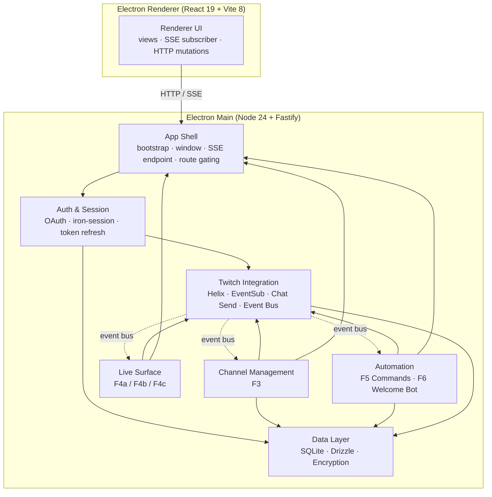
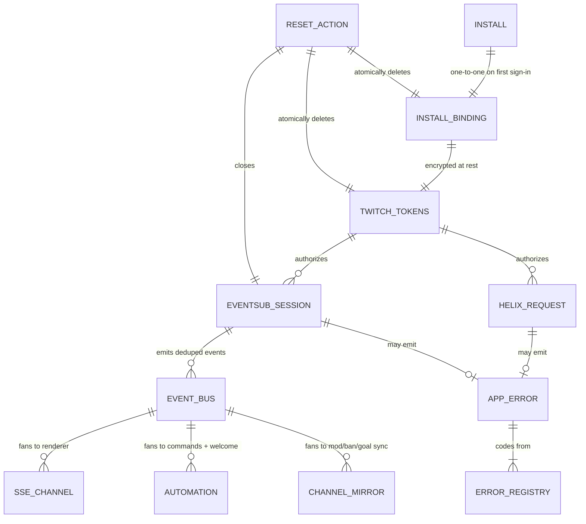
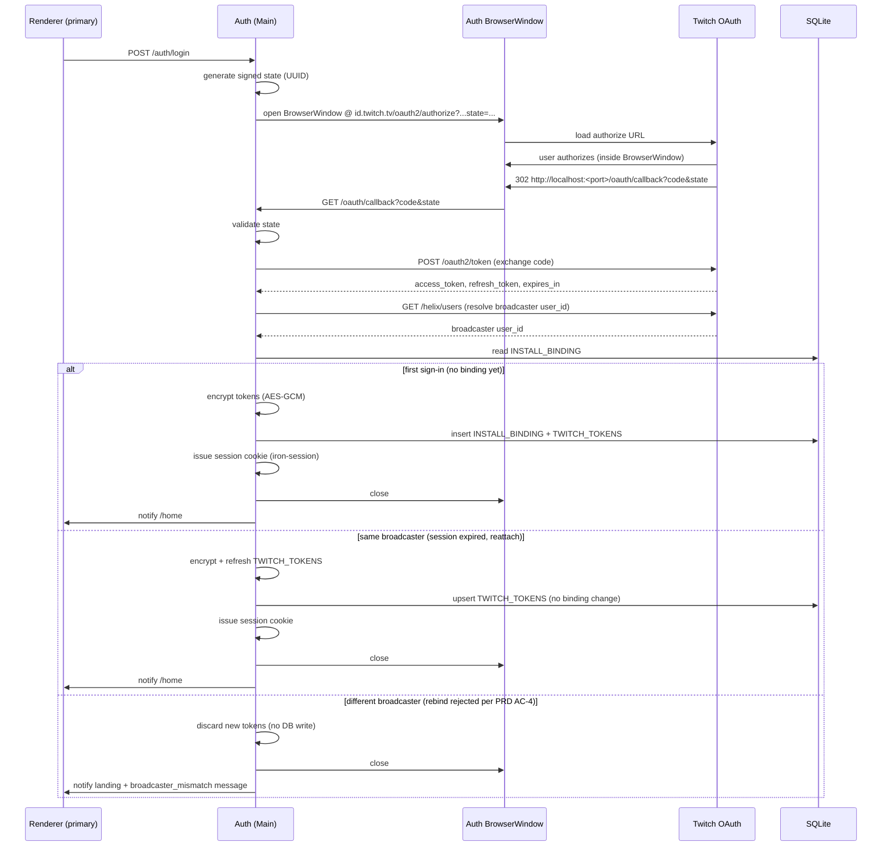
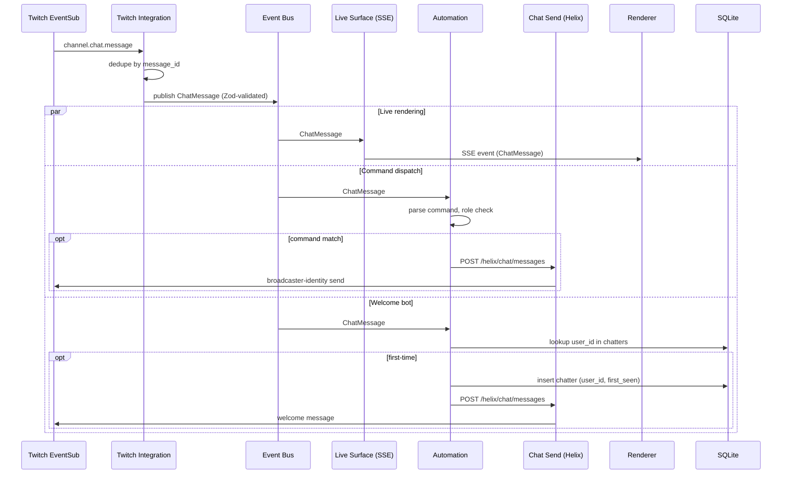

# Streaming Control Panel — Technical Architecture

## Status

This document defines the technical architecture for the Streaming
Control Panel. It establishes the system shape, core stack, and
foundational decisions that all downstream epics and tech designs
inherit. Companion to the PRD (`docs/prd.md`), which establishes product
scope and behavior.

Research inputs: `docs/research/2026-04-16-stack-consolidated.md` and
live version verification against upstream docs on 2026-04-16.

---

## Architecture Thesis

The Streaming Control Panel is a **local desktop application packaged as
Electron**. Each install is bound to exactly one Twitch broadcaster. A
local **Node 24 + Fastify** server process runs inside the Electron main
process and owns all Twitch API interaction, EventSub WebSocket sessions,
encrypted token storage, and persistent state in a local SQLite database.
The renderer process (**React + Vite**) is the streamer's UI; it receives
live updates via Server-Sent Events from the local server and sends
mutations over ordinary HTTP. Twitch integration is **hand-rolled** — no
external SDK dependency. There are no cloud services, no shared
infrastructure, and no cross-tenant surface to defend: everything a
streamer generates lives on their own machine.

---

## Core Stack

All versions verified against upstream docs on 2026-04-16.

| Component | Choice | Version | Rationale | Checked | Compatibility Notes |
|-----------|--------|---------|-----------|---------|---------------------|
| Language | TypeScript | 5.x | End-to-end type coverage; Zod contracts shared across server, client, and shared package. | 2026-04-16 | — |
| Runtime | Node.js | 24 LTS | Entered Maintenance LTS 2026-04-15; still the current production LTS. Next Active LTS (Node 26) ships Oct 2026 — plan an upgrade window then. | 2026-04-16 | Node 24.14.1 ships inside Electron 41. |
| Package manager / monorepo | pnpm workspace | 10.x | Efficient hoisting; workspace protocol for `apps/panel/shared`; matches liminal-build reference shape. | 2026-04-16 | — |
| Desktop packaging | Electron | 41 | Current stable (v41.2.1 released 2026-04-15). Ships Node 24.14.1 + Chromium 146. Production ships packaged; dev uses raw Node + Vite dev server. | 2026-04-16 | Node ABI alignment with `better-sqlite3` via `electron-rebuild`. |
| Backend framework | Fastify | 5.x | Long-lived connections, plugin-based DI, first-class TS, Zod integration via `@fastify/type-provider-zod`. | 2026-04-16 | Runs cleanly on Node 24. |
| Frontend framework | React | 19 | UI surface (dashboards + live chat + CRUD) exceeds plain TS DOM's comfort zone. React 19.2.1 stable since Dec 2025. | 2026-04-16 | Supported by shadcn/ui. |
| Bundler | Vite | 8 | Dev server for renderer; production bundle loaded from disk by Electron. | 2026-04-16 | Compatible with React 19 + Tailwind 4. |
| Styling | Tailwind CSS | 4.1 | CSS-native Oxide engine; no PostCSS config. | 2026-04-16 | Supported by shadcn/ui since Feb 2025. |
| Component library | shadcn/ui | current | Copy-in components with Tailwind 4 + Radix primitives; owned in-repo, not versioned as a dep. | 2026-04-16 | — |
| Database | SQLite (local file) | — | Single-process, single-install, local file. No network, no pool. | 2026-04-16 | One file per install; location via OS userData path. |
| SQLite driver | better-sqlite3 | current stable | Synchronous API fits a single-process Node server. Battle-tested under Electron. | 2026-04-16 | Requires `electron-rebuild` against Electron's Node ABI. |
| ORM | Drizzle ORM | 0.45.x | Low runtime overhead, Zod integration (`drizzle-zod`), SQL-authored migrations via `drizzle-kit`. | 2026-04-16 | v1.0 is still beta; stay on the 0.45.x stable line. |
| Validation | Zod | 4.x | Shared contract layer; drives runtime parsing at every boundary. | 2026-04-16 | — |
| Auth session | iron-session | current | Stateless encrypted cookie sessions; no server-side session table needed for single-install local. | 2026-04-16 | Works with Fastify via `@fastify/cookie`. |
| Token-at-rest encryption | AES-256-GCM (Node `crypto`) + OS keychain key storage | stdlib + `keytar` or equivalent | Encrypt refresh/access tokens before persisting; encryption key in the OS keychain. | 2026-04-16 | Envelope-encryption fallback if keychain unavailable. |
| Unit tests | Vitest | 4.1 | Shared runtime with Vite; TS-native. | 2026-04-16 | — |
| E2E tests | Playwright | current | Critical path coverage (OAuth, go-live, !command fires). Headed against packaged Electron possible via `playwright-electron`. | 2026-04-16 | — |
| Lint / format | Biome | 2.4 | Single binary; faster than eslint+prettier. | 2026-04-16 | — |

### Rejected Alternatives

| Considered | Why Rejected |
|------------|--------------|
| Convex as primary backend | Actions cap at 10 min; cannot hold long-lived EventSub WebSocket. Also inappropriate for local-only single-tenant. |
| Postgres / Neon | Overkill for local single-tenant. SQLite file has no network round-trip, no connection pool, no separate hosting. |
| Hosted deployment (Render / Fly.io) | v1 is local-only per PRD. A hosted variant is a Future Direction; architecture preserves room for it but does not build for it. |
| Twurple / other Twitch SDK | User directive: Twitch integration is hand-rolled. Twurple source remains a reference consult only. |
| Server-backed session table | Overkill for single-tenant local. Stateless encrypted cookies suffice. |
| WebSocket for server → renderer | Renderer's live needs are one-directional. SSE is simpler, auto-reconnects over HTTP, and mutations fit ordinary HTTP. Re-openable if a bidirectional need emerges. |
| `node:sqlite` | Still Release Candidate as of Node 25.7.0; not production-stable for v1. Re-evaluate when it reaches stability ≥ 2. |
| Plain TS DOM (liminal-build style) | UI surface here is larger; React's component model pays off. |
| Legacy Twitch IRC | Twitch is decommissioning IRC. EventSub `channel.chat.message` is the forward path. |

---

## System Shape

### Repository Layout

The workspace is a single pnpm workspace containing one app:

```
apps/
  panel/
    server/      — Fastify server code (runs in Electron main process)
    client/      — React renderer code (built by Vite)
    shared/      — Zod schemas and shared types consumed by both sides
```

Shared contracts (HTTP request/response shapes, SSE event payloads,
typed errors) live in `apps/panel/shared/` and are imported by both
`server/` and `client/`. Tech designs extend this shared package; no
epic introduces a parallel shared location.

### Runtime Surfaces

The runtime is two processes in one OS-level process tree:

- **Electron main process** — hosts the local Fastify server, owns all persistent state and Twitch connections. The only process with filesystem and network access.
- **Electron renderer process** — the React app. Communicates with the local server over `http://localhost:<port>` for mutations and `/live/events` SSE for live updates. Has no direct access to Twitch and never touches raw tokens.

Seven top-tier domains organize the behavior across these processes:



**Top-tier domains:**

| Domain | Owns | Depends On | Downstream Inherits |
|--------|------|------------|---------------------|
| **App Shell** | Electron main-process lifecycle; Fastify bootstrap; window management; HTTP route registration; the single `/live/events` SSE endpoint; renderer↔server wiring; route-gating middleware; **Settings view** (hosts the Reset app action, per PRD AC-5). | Auth (to authorize gated routes). | New HTTP/SSE endpoints register through Shell. No epic spawns a parallel server. |
| **Auth & Session** | Twitch OAuth authorize + localhost callback; `POST /oauth2/token` code-for-token exchange; refresh-token loop (silent refresh ahead of expiry); install-to-broadcaster binding check on callback (rejects a different broadcaster per PRD AC-4); session cookies (iron-session); re-auth detection. | Data Layer (encrypted token read/write). | Auth owns the OAuth token lifecycle end-to-end. Other domains never call Twitch's OAuth endpoints directly. |
| **Twitch Integration** | The hand-rolled Twitch module: Helix REST client (rate-limit + pagination aware); EventSub WebSocket session manager (reconnect, state recovery, dedup); chat-send wrapper; scope / subscription registry; **in-process event bus** that fans Twitch events to internal consumers. | Data Layer (reads current access token from the encrypted store). | Every Twitch-touching feature consumes Helix via this module and subscribes to events via the bus. No epic imports a Twitch SDK. No epic calls Twitch's OAuth endpoints — that's Auth's role. |
| **Channel Management** | F3 behavior: channel property edits; read-only goal / mod / ban / follower / subscriber surfaces; live sync of mod/ban/goal state via the bus. | Twitch Integration (Helix + bus); Data Layer. | F3 epic nests entirely in this domain. |
| **Live Surface** | F4a/b/c behavior: live detection; live chat rendering; viewer count; chat restriction toggles; message-anchored mod actions; clip creation. | Twitch Integration (bus + Helix calls); App Shell (SSE endpoint). | F4a/b/c epics nest here. |
| **Automation** | F5/F6 behavior: `!command` definition + role-tiered dispatch; chatter tracking; welcome bot. | Twitch Integration (bus + chat send); Data Layer. | F5/F6 epics nest here. |
| **Data Layer** | SQLite file location (OS userData path); Drizzle schemas + migrations; token-at-rest encryption wrappers; the `user_id`-as-primary-key convention; **atomic install reset** (bulk wipe of all tables + keychain key material, used by the Reset app action). | Node stdlib; OS keychain for encryption key. | Every feature that persists state declares tables here. No epic opens a parallel persistence path. Atomic reset is the only sanctioned bulk-delete path. |

The **event bus** inside Twitch Integration is the connective tissue this architecture leans on most. EventSub events arrive on the WebSocket, are deduplicated by `Twitch-Eventsub-Message-Id`, normalized into typed event shapes, and fan out to consumers: Live Surface streams chat to SSE subscribers, Automation evaluates command matches and welcome-bot triggers, Channel Management updates mod/ban/goal mirrors. A reader navigating the repo should find this bus as a first-class concept — not buried inside an EventSub adapter.

---

## Cross-Cutting Decisions

### Single-Install Binding, No Rebind

**Choice:** Each installed instance binds to exactly one Twitch broadcaster identity on first sign-in. Binding is stored in the local SQLite database. **Signing in with a different Twitch account is rejected** at the OAuth callback — the new tokens are discarded without mutating install-local state, and the streamer is directed to the Reset app action (per PRD AC-4). Broadcaster switching only happens via the Reset app action (see Install Reset is Atomic below), not via a sign-in.

**Rationale:** The PRD commits to local-only single-install for v1. Treating the install as single-broadcaster **by construction** — rather than as a general multi-tenant server that happens to host one — simplifies the data layer (no `tenant_id` column on every table), simplifies routing (no per-request scoping middleware), and simplifies the threat model (no cross-broadcaster leakage path to defend). Rejecting rebind (rather than silently replacing prior state) protects the streamer from accidental destructive account switches.

**Consequence:** Epics do not thread an install- or broadcaster-ID through data access; the binding is implicit. Feature schemas carry no `tenant_id` / `broadcaster_id` foreign key. The OAuth callback in Auth checks the resolved broadcaster ID against the bound broadcaster before persisting tokens. A future hosted multi-broadcaster variant would require adding a tenant key across every schema and query-scoping everywhere — that cost is acknowledged and deferred.

### Install Reset is Atomic

**Choice:** The Reset app action (PRD AC-5) is an **atomic install-wide reset**. It invokes a coordinated teardown across every domain that holds install-local state, and only after every step completes is the install considered pre-first-sign-in. Steps, in order:

1. Close the EventSub WebSocket session (Twitch Integration).
2. Clear all in-process caches and pending schedulers (token refresh timer, any Helix retry queues).
3. Drop every Fastify session (invalidate current iron-session cookies).
4. Wipe all SQLite tables (bindings, tokens, commands, chatters, welcome-bot state, recent clips) — a single transaction or sequential table truncation.
5. Delete the OS-keychain-stored encryption key (or the envelope-fallback key material).
6. Force the renderer to reload to the landing view.

**Rationale:** Because the PRD removes `tenant_id` from feature tables, there is no per-broadcaster scoping to protect against stale data leaking across bindings. The integrity of broadcaster identity after a Reset depends entirely on leaving nothing behind. Missing any step — especially EventSub session teardown or in-memory cache clear — can produce subtle bugs where the new binding inherits state from the previous broadcaster. Atomicity (ordered, all-or-nothing) is the only correct shape.

**Consequence:** Every domain that holds install-local state exposes a `reset()` entry point (name is tech-design detail) that the Reset orchestration calls in order. No domain may persist state outside these entry points. Tech designs for F2 must define the orchestration owner (Auth is the natural home since it receives the Reset request, but implementation may route through App Shell) and a transactional contract.

### Localhost Trust Boundary

**Choice:** The local Fastify server defends its authenticated routes against same-machine cross-origin requests. The primary defense is **Origin header validation** on every state-changing route — a Fastify preHandler rejects any request whose `Origin` header does not match the renderer's known origin. Session cookies are `HttpOnly` and `SameSite=Strict`. GET routes that carry no side effects may relax Origin checks but still require an authenticated session.

**Rationale:** `http://localhost:<port>` is reachable from any browser tab or local process on the streamer's machine. An attacker-controlled web page visited in a browser tab could attempt to issue authenticated requests to our localhost server. Modern Chromium reliably sends the `Origin` header on cross-origin POSTs; the server can reject any Origin that isn't the renderer's. `SameSite=Strict` prevents the session cookie from accompanying cross-site requests at all. Together these close the cross-origin attack window without requiring CSRF tokens on every route.

**Consequence:** Every authenticated mutation route inherits Origin validation through the preHandler — tech designs do not opt out per-route. The renderer's exact origin value depends on how it's loaded (file://, custom app:// protocol, or the Vite dev server in development) — that's a tech-design choice resolved during App Shell epic. The architecture commits to the validation pattern; tech design resolves the origin string.

### OAuth Auth Surface: In-App Electron BrowserWindow

**Choice:** Twitch OAuth runs inside a dedicated Electron `BrowserWindow` the main process opens when the streamer clicks "Sign in with Twitch." The window loads Twitch's authorize URL directly. Twitch redirects back to `http://localhost:<port>/oauth/callback`, which the local Fastify server catches. Main process closes the auth window and the primary renderer reloads into the authenticated state.

**Rationale:** Three reasons. (1) **Single cookie jar.** The auth BrowserWindow and the primary renderer share Electron's default session, so the session cookie issued by the local server lands where the renderer can use it. The system-browser alternative requires a custom-protocol handoff because the cookie jar split otherwise leaves the Electron app unauthenticated. (2) **No OS-level protocol registration.** Custom `app://`-style protocol handlers introduce per-OS installer complexity (Windows especially) and corner cases on uninstall/reinstall. A BrowserWindow bypasses that entirely. (3) **Twitch allows embedded auth.** Unlike Google and some other providers, Twitch does not block OAuth in embedded browser contexts, so the BrowserWindow approach doesn't hit a platform wall.

**Consequence:** Auth's OAuth flow owns the BrowserWindow lifecycle — creation on `/auth/login`, destruction on callback completion or user cancel. The primary renderer does not navigate to Twitch. Tech design for F2 settles the BrowserWindow's configuration (size, parent, modal-ness, session partition if any). The accepted trade-off is that the streamer cannot reuse an existing system-browser Twitch login — they sign in fresh inside the BrowserWindow, once, on first install.

### Transport: HTTP + SSE, Not Electron IPC

**Choice:** The renderer communicates with the local server over HTTP (mutations, reads) and SSE (live push). Electron's built-in `ipcMain` / `ipcRenderer` IPC is **not** used for app-data communication.

**Rationale:** Three reasons. (1) **Uniform validation.** Zod-validated HTTP/SSE boundaries apply identically whether the server is in the Electron main process or a remote host — a future hosted variant reuses the same contracts. (2) **Testability.** Standard HTTP tooling (Playwright, curl) covers the renderer↔server surface; IPC would require Electron-specific test harnesses. (3) **Single interface.** The renderer has exactly one way to reach the server; tech designs don't choose between IPC and HTTP per feature.

**Consequence:** No epic introduces `ipcRenderer.invoke` / `ipcMain.handle` for app-data flows. Native OS interactions that genuinely require IPC (window controls, native menus, file-dialog, notifications) may use IPC; those are App Shell concerns and do not cross the app-data boundary.

### Token-at-Rest Encryption

**Choice:** AES-256-GCM (Node stdlib `crypto`) for refresh and access tokens before writing to SQLite. Encryption key stored via OS keychain (`keytar` or equivalent native module), with an envelope-encryption fallback if keychain access is unavailable.

**Rationale:** The SQLite file lives on the streamer's disk but stays exposed if backed up, synced, or copied. Encrypting at rest defends against off-machine token exfiltration. Keychain-backed keys inherit the OS's credential protection; the fallback keeps install robust on unusual OS configurations.

**Consequence:** Every token read/write routes through an encryption wrapper in the Data Layer. The renderer process never reads tokens — all token-aware paths are main-process-only. Auth and Twitch Integration tech designs inherit this; no epic persists plaintext tokens.

### EventSub Session Strategy

**Choice:** One long-lived EventSub WebSocket per install against `wss://eventsub.wss.twitch.tv/ws`. On `session_welcome`, subscribe to all currently-active topics inside Twitch's 10-second subscribe window. On `session_reconnect`, keepalive silence, or unexpected close, reconnect with exponential backoff, re-subscribe, and **REST-fetch current state** for every stateful live surface before declaring the UI live again. Deduplicate every event by `Twitch-Eventsub-Message-Id`.

**Rationale:** Twitch does not replay lost events after a disconnect; a naive reconnect silently drops truth. REST state recovery is the only correct path. EventSub is at-least-once — dedup is required or retries produce double welcomes, double bans, and double command fires.

**Consequence:** Every live surface declares (a) the EventSub topics it subscribes to and (b) the Helix endpoint it uses to REST-resync on reconnect. Twitch Integration enforces both via the subscription registry. No epic treats EventSub as fire-and-forget or invents its own dedup.

### Live Transport: SSE from Server, HTTP for Mutations

**Choice:** A single long-lived Server-Sent Events connection pushes live events (chat messages, viewer count, chat restriction changes, mod-action confirmations, welcome-bot activity, goal updates) from the local server to the renderer. Mutations initiated by the renderer (ban, clip, command create, channel edit) use ordinary HTTP POST/PATCH.

**Rationale:** The renderer's live needs are one-directional. SSE auto-reconnects over HTTP; no custom reconnect protocol. A full WebSocket adds bidirectional flexibility not currently needed and complicates the transport story. Mutations are per-request and fit plain HTTP.

**Consequence:** App Shell exposes exactly one `/live/events` SSE endpoint per authenticated session. Every live consumer (Live Surface, Channel Management live syncs, Automation UI surfaces) multiplexes through this endpoint via named event types. No epic opens a parallel WebSocket between renderer and server.

### Identity Convention: Twitch `user_id` Everywhere

**Choice:** Every persistent reference to a Twitch viewer — chatter, moderator, banned user, command triggerer, welcome target — uses the Twitch `user_id` (stable, opaque) as the primary key. Display name and login are presentation-only and updated on write.

**Rationale:** Twitch accounts rename. Keying on username produces duplicate records on rename and loses historical association. Keying on `user_id` survives rename, deletion, and re-registration.

**Consequence:** Data Layer schemas enforce this: any viewer-referencing table uses `user_id` as foreign key. Every feature extracts `user_id` first from a chat event; display name is treated as mutable presentation data.

### Validation at Every Boundary (Zod-First Contracts)

**Choice:** Zod schemas are the single contract source for (a) HTTP request/response shapes between renderer and server, (b) SSE event payloads, (c) Twitch API response parsing inside the Helix client, (d) config file parsing at bootstrap. Shared schemas live in `apps/panel/shared/`.

**Rationale:** A hand-rolled Twitch integration implies parsing Twitch JSON manually; without runtime validation, drift between Twitch's API and our types becomes invisible. Zod-validated boundaries catch drift immediately and emit typed data downstream.

**Consequence:** Every HTTP route registers Zod input/output schemas via `@fastify/type-provider-zod`. Every SSE event has a Zod schema. Every Twitch response is parsed through Zod before leaving the Helix client. Epics extend the shared schema set; no un-validated paths are added.

### Error Model: Typed Errors + Stable Codes

**Choice:** A single `AppError` class in `shared/` carries a stable machine-readable `code` (e.g., `AUTH_TOKEN_REVOKED`, `TWITCH_RATE_LIMITED`, `DATA_NOT_FOUND`, `INPUT_INVALID`). Server routes convert thrown `AppError` into an HTTP response with the code in the body. The renderer switches on the code, not the message.

**Rationale:** HTTP status alone is too coarse; parsing human-readable messages is brittle. A stable code registry gives the renderer a single switch point per error class. Codes are append-only — once shipped, a code never changes meaning.

**Consequence:** Every new route adds any new codes to the shared registry. Renderer error handling switches on the code. No epic introduces an ad-hoc error shape.

### Cross-Cutting Connective Tissue

How the cross-cutting decisions relate at runtime:



| Relationship | Downstream Inherits |
|--------------|---------------------|
| INSTALL ↔ INSTALL_BINDING (1:1) | The binding row is the single identity anchor; all feature data lives under this binding implicitly. No FK on feature tables. |
| TWITCH_TOKENS authorizes both EventSub and Helix | Both paths read the current access token from the same encrypted store; refresh is centralized in Auth. |
| EVENT_BUS fans to three consumer classes | Any new live-event consumer subscribes to the bus. New event types are added to the shared Zod event schema. |
| APP_ERROR ← ERROR_REGISTRY | Codes are append-only. Every error surfaced to the renderer carries a code. |
| RESET_ACTION touches three persistent + one session | Reset must visit each of these in the ordered teardown; partial reset is not a valid state. |

---

## Boundaries and Flows

Three flows carry most of the architectural weight.

### Flow 1: OAuth Sign-In with Broadcaster Binding Check



**Breakdown:**

1. Renderer posts to `/auth/login`; Auth mints a signed state and opens a dedicated Electron BrowserWindow pointed at Twitch's authorize URL.
2. User authorizes inside the BrowserWindow (Twitch's UI renders there).
3. Twitch redirects to `http://localhost:<port>/oauth/callback`; because the BrowserWindow shares Electron's default session, the request hits the local Fastify server with no cookie-jar split.
4. Auth validates state, exchanges code for tokens, and resolves the broadcaster `user_id` via `GET /helix/users` before touching persistent state.
5. Auth reads the current install binding and branches:
   - **First sign-in**: persist binding and tokens; issue session.
   - **Same broadcaster reattach**: refresh tokens only; issue session.
   - **Different broadcaster**: discard new tokens, signal the primary renderer to return to landing with a `broadcaster_mismatch` message pointing at Reset app.
6. Auth closes the BrowserWindow. The primary renderer navigates (or stays on) the appropriate view.

**Downstream inherits:** Auth owns the entire OAuth + binding-check path. The localhost callback port is reserved at server bootstrap (App Shell). Tokens never leave the Data Layer. Feature epics that need new scopes register them with the Auth scope registry at grant time (per PRD A3); scope step-up post-v1 is out of scope.

### Flow 2: Live Chat Event → SSE + Automation Fan-Out

The load-bearing live path. One incoming EventSub chat event feeds multiple domains in parallel.



**Breakdown:**

1. Twitch EventSub delivers the chat event on the long-lived WebSocket.
2. Twitch Integration dedupes by `Twitch-Eventsub-Message-Id` and publishes a typed `ChatMessage` to the in-process bus.
3. Three consumers process in parallel:
   - Live Surface streams the event over SSE to the renderer for live chat rendering.
   - Automation's command dispatcher matches against the `!command` set (role-gated by MOD/VIP/GENERAL) and, on match, sends a response via Chat Send.
   - Automation's welcome-bot checker looks up `user_id` in the chatters table; if unseen, records it atomically and sends the welcome message.
4. Bot-sent chat messages themselves arrive back as `channel.chat.message` events; dedup prevents treating them as new user messages when appropriate, and bot posts are suppressed from further bot-triggering logic to avoid feedback loops.

**Downstream inherits:** The bus is the fan-out point. F5 and F6 epics consume the `ChatMessage` event shape; they do not subscribe to EventSub directly. F4a (Live Detection) inherits the SSE channel pattern. No epic bypasses the bus to reach EventSub or adds a parallel subscription.

### Flow 3: Install Reset (Atomic Teardown)

The Reset app action wipes install-local state across every domain that holds it. The sequence is ordered: live connections close first, then in-memory state, then persistent state, then the encryption key. Failure at any step aborts Reset and leaves install-local state as it was.

```mermaid
sequenceDiagram
    participant R as Renderer
    participant AUTH as Auth (orchestrator)
    participant TI as Twitch Integration
    participant SH as App Shell
    participant D as Data Layer
    participant KC as OS Keychain

    R->>AUTH: POST /settings/reset (confirmed)
    AUTH->>TI: close EventSub session
    TI-->>AUTH: ok
    AUTH->>TI: clear in-memory caches + cancel refresh timer
    TI-->>AUTH: ok
    AUTH->>SH: invalidate all iron-session cookies
    SH-->>AUTH: ok
    AUTH->>D: BEGIN TRANSACTION; TRUNCATE all tables; COMMIT
    D-->>AUTH: ok
    AUTH->>KC: delete install encryption key
    KC-->>AUTH: ok
    AUTH-->>R: 200 { reset: "complete" }
    R->>R: reload to landing view
```

**Breakdown:**

1. Renderer posts to `/settings/reset` after the user confirms the action (PRD AC-5).
2. Auth orchestrates the teardown in order: EventSub session close → caches + timers → sessions → DB tables → keychain key.
3. On success, the renderer reloads to the landing view (pre-first-sign-in).
4. If any step fails, Reset aborts and the error is surfaced; no partial-reset state is visible.

**Downstream inherits:** Auth is the Reset orchestrator; every domain exposes a single `reset()` entry point that Auth invokes in order. No domain may persist state outside these entry points. Tech designs for F2 define the exact per-domain contract; the arch settles the orchestration shape.

---

## Constraints That Shape Epics

- **Local-only, single-install.** Epics cannot assume cloud services, shared state across installs, or multi-broadcaster operation. Scope decisions favor local-first simplicity.
- **Main ↔ renderer process boundary.** The renderer has no Twitch access, no filesystem access, and never sees raw tokens. Every Twitch call and every persistent write goes through a main-process HTTP route.
- **Hand-rolled Twitch integration.** No epic introduces a Twitch SDK dependency. Twurple and similar remain reference-only.
- **Twitch rate limits and EventSub 300-subscription cap.** Epics that add topics or paginated reads must declare the cost. Current subscription budget is ~13 per install; far from cap, but tracked.
- **Twitch does not replay EventSub events on reconnect.** Every live-state epic must define its REST-resync endpoint. Reconnect without resync is a bug.
- **10-second EventSub subscribe window after `session_welcome`.** All active topics subscribe via the Twitch Integration registry inside this window; epics that introduce new topics register them at subscription-registry-declaration time, not at runtime in response to an event.
- **SQLite is single-process.** The Electron main process is the sole writer. Renderer cannot touch the DB directly.
- **No viewer-facing surface in v1.** Features drifting toward overlays, alerts, or public pages are rejected at the PRD level. Architecture does not accommodate browser sources in v1.
- **No bundler on the server.** The Fastify server runs directly on Node with TypeScript via `tsx` in dev or compiled output in production. Vite only bundles the renderer.

---

## Open Questions for Tech Design

- **Electron packaging tool.** `electron-builder` vs `electron-forge` vs `electron-vite`. Affects icons, installers, code-signing path, and auto-update wiring.
- **Auto-update strategy.** Whether the packaged app self-updates, and via what channel (GitHub Releases, a static update endpoint, none). Can defer to post-v1 if manual reinstall is acceptable.
- **EventSub reconnect backoff policy.** Exponential base, cap, jitter. Needs a tech-design-level commitment; probably in the F4a tech design where Live Surface first consumes it.
- **Session cookie TTL.** PRD requires "survives browser close/reopen within session TTL." A concrete value (7 days? 30 days?) is a tech-design choice in the F2 tech design.
- **Renderer state model.** React Context + `useSyncExternalStore`, lightweight pub/sub (liminal-build pattern), Zustand, or TanStack Query. Pick during App Shell tech design.
- **Error code registry shape.** Discriminated union, string enum, or typed const map. Pick during App Shell tech design alongside the error model wiring.
- **better-sqlite3 vs `node:sqlite`.** Committed to `better-sqlite3` for v1. Re-evaluate when `node:sqlite` reaches stability ≥ 2.
- **Job queue need.** Deferred. Token refresh and failed chat-send retry can run in-process with setTimeout/setImmediate scheduling. Revisit if scheduled bot messages (Future Direction) arrive.
- **Horizontal sharding threshold.** Not relevant for single-install local. Only becomes a question if a hosted multi-broadcaster future direction is opened.
- **Encryption key fallback mechanics.** Exact shape of the envelope fallback when `keytar` is unavailable — machine-entropy-derived key vs user-prompted passphrase. Decide in F2 tech design.

---

## Assumptions

| ID | Assumption | Status | Notes |
|----|------------|--------|-------|
| A1 | `better-sqlite3` compiles cleanly against Electron's Node ABI on Windows, macOS, and Linux with `electron-rebuild`. | Unvalidated | Verify in App Shell epic spike. |
| A2 | OS keychain access (`keytar` or equivalent) is available across supported platforms for encryption-key storage, with envelope fallback covering the remainder. | Unvalidated | Verify in Auth epic. |
| A3 | Twitch accepts `http://localhost:<port>/oauth/callback` as a registered redirect URI on the Twitch developer app. | Unvalidated | Per PRD A5. Verify in F2 epic spike. |
| A4 | The Electron renderer consumes SSE over `http://localhost:<port>` without proxy buffering issues. | Likely | No reverse proxy in the path. Verify in App Shell epic. |
| A5 | Tailwind v4 + shadcn/ui render correctly under Electron's Chromium (146 as of Electron 41). | Likely | Standard web stack; no Electron-specific concerns expected. |
| A6 | Drizzle 0.45.x (stable; v1.0 still beta) is production-ready for v1. | Likely | Drizzle has shipped production releases for years; v1 is primarily a rebrand + API polish. |
| A7 | A single local Node process can hold the EventSub WebSocket, the Fastify HTTP server, and the SSE channel concurrently under normal load for one streamer. | Likely | Load is bounded by one streamer. Ceiling is theoretical in v1. |
| A8 | Node 24 LTS remains supported through the v1 lifecycle (into 2027). | Validated | Node 24 Maintenance LTS runs into April 2027. Upgrade to Node 26 when it enters Active LTS (Oct 2026). |

---

## Relationship to Downstream

**This document settles:**

- Runtime and packaging: Electron 41 + Node 24.
- Core stack: Fastify 5, React 19, Vite 8, SQLite + better-sqlite3 + Drizzle 0.45.x, Tailwind 4.1 + shadcn/ui, Zod 4, Vitest 4, Biome 2.
- System shape: seven top-tier domains, two runtime processes, one in-process event bus as connective tissue.
- Cross-cutting decisions: single-install binding (no rebind), atomic install reset, localhost trust boundary, HTTP + SSE transport (not Electron IPC), token-at-rest encryption, EventSub session strategy, `user_id` identity convention, Zod-first contracts, typed error model with stable codes.
- Key flows: OAuth sign-in, chat event fan-out.
- Constraints on what epics may assume and introduce.

**Epic specs (`ls-epic`) settle:**

- Line-level ACs and TCs for each feature.
- Per-feature data contracts at system boundaries.
- User scenarios and flow decomposition.
- Story breakdown.

**Tech design (`ls-tech-design`) still decides:**

- Module decomposition within each top-tier domain.
- Interface definitions, type signatures, component props.
- Database schema specifics (columns, indexes, migration plan).
- Per-feature event payload schemas (extending the Zod shared set).
- Test architecture (TC-to-test mapping, mock strategy, Playwright coverage).
- Implementation sequences and story-level chunk breakdown.
- Resolved values for the open questions above (packaging tool, session TTL, renderer state, error code registry shape, reconnect backoff).

This tech arch is the starting position, not a decree. Tech designs that surface new facts warranting revision — a dependency constraint, a platform limitation, a better pattern — proceed with the better approach, document the deviation, and surface it upstream for backfill.
