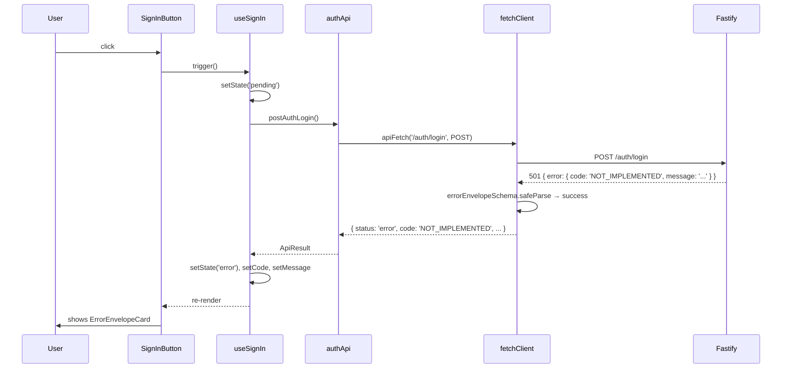
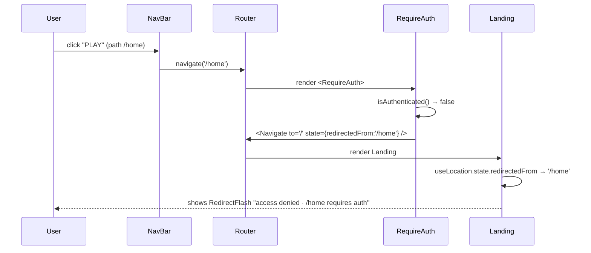
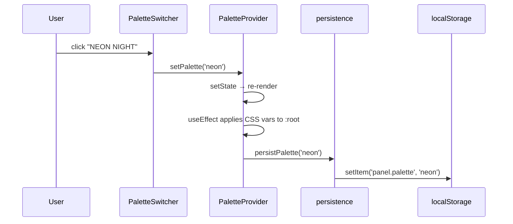

# Technical Design: Epic 1 — Client Companion

This companion carries implementation depth for the `apps/panel/client/` package — the React 19 renderer: Vite config, router + route registry, `<RequireAuth>` guard, landing view composition, the 5-palette system + switcher, the sign-in handler (error-code-first per D6), and the typed API client. The package is named `client` per the epic's AC-3.3 vocabulary; the code inside it runs in Electron's **renderer process** (an Electron-specific term, distinct from the package name).

Cross-references back to the index ([`tech-design.md`](./tech-design.md)) keep requirement traceability intact. Visual and interaction detail (what each component looks like, what states it carries, how the 5 palettes differ) lives in the UI companion ([`ui-spec.md`](./ui-spec.md)). This doc owns module identity, TypeScript interfaces, and module placement; the UI spec owns visual structure, state presentation, and token usage. The ownership split is per the skill's one-way ownership contract.

---

## Table of Contents

- [Package Layout](#package-layout)
- [Vite Config](#vite-config)
- [Router](#router)
- [Route Registry and Gating](#route-registry-and-gating)
- [RequireAuth Guard](#requireauth-guard)
- [Landing View](#landing-view)
- [Palette System](#palette-system)
- [Sign-In Handler](#sign-in-handler)
- [API Client](#api-client)
- [State Model](#state-model)
- [Placeholder Routes](#placeholder-routes)
- [Flows](#flows)
- [Interface Definitions](#interface-definitions)

---

## Package Layout

```
apps/panel/client/
├── package.json
├── tsconfig.json
├── index.html
├── src/
│   ├── main.tsx                      # entry: createRoot, mount <App />
│   ├── App.tsx                       # top-level providers + router
│   ├── app/
│   │   ├── router.tsx                # React Router setup, route tree
│   │   ├── defineRoute.ts            # route registry factory (D13)
│   │   ├── routes.ts                 # declarative route list (single source of truth)
│   │   └── RequireAuth.tsx           # gated-route guard
│   ├── views/
│   │   ├── Landing.tsx               # landing view (neo-arcade composition)
│   │   ├── HomePlaceholder.tsx       # gated empty placeholder
│   │   └── SettingsPlaceholder.tsx   # gated empty placeholder
│   ├── components/
│   │   ├── Marquee.tsx               # top scrolling banner
│   │   ├── NavBar.tsx                # app nav with gated-route redirect flash
│   │   ├── SignInButton.tsx          # primary sign-in action (AC-1.3)
│   │   ├── ErrorEnvelopeCard.tsx     # renders typed error responses
│   │   ├── SystemStatusPanel.tsx     # HUD: SSE, Origin, SQLite, Bind status
│   │   ├── ErrorRegistryPanel.tsx    # HUD: error code registry display
│   │   ├── CapabilityGrid.tsx        # 5-tile capability list (AC-1.2)
│   │   ├── Footer.tsx
│   │   └── RedirectFlash.tsx         # access-denied flash for gated-nav attempts
│   ├── palette/
│   │   ├── palettes.ts               # 5 palette token definitions
│   │   ├── PaletteProvider.tsx       # context + CSS-var injection
│   │   ├── PaletteSwitcher.tsx       # user-facing palette picker
│   │   ├── usePalette.ts             # hook consumer
│   │   └── persistence.ts            # read/write palette preference to localStorage
│   ├── api/
│   │   ├── fetchClient.ts            # typed fetch wrapper with envelope parsing
│   │   ├── authApi.ts                # POST /auth/login client (AC-1.3)
│   │   └── paletteApi.ts             # GET/PUT palette preference (D9 persistence)
│   ├── hooks/
│   │   └── useSignIn.ts              # encapsulates sign-in mutation (D6 handler)
│   └── styles/
│       ├── globals.css               # Tailwind 4 entry + CSS var declarations
│       └── fonts.css                 # Press Start 2P + Space Mono @font-face
└── vite.config.ts                    # standalone Vite config for renderer-only dev (AC-3.3)
```

`vite.config.ts` at the client package root is what makes `pnpm --filter client dev` work standalone (AC-3.3). The electron-vite config at the repo root also consumes it (when it invokes Vite under electron-vite's orchestration in full-app dev mode).

---

## Vite Config

### Client-Standalone (`apps/panel/client/vite.config.ts`)

Runs via `pnpm --filter client dev`. Serves the landing view in a browser without Electron, Fastify, or native modules.

```typescript
// apps/panel/client/vite.config.ts
import { defineConfig } from 'vite';
import react from '@vitejs/plugin-react';
import tailwind from '@tailwindcss/vite';
import path from 'node:path';

export default defineConfig({
  root: __dirname,
  plugins: [react(), tailwind()],
  resolve: {
    alias: {
      '@panel/shared': path.resolve(__dirname, '../shared/src'),
      '@': path.resolve(__dirname, 'src'),
    },
  },
  server: {
    port: 5173,
    strictPort: true,
  },
});
```

`strictPort: true` keeps the Origin allow-set resolvable — the server's allow-set trusts `http://localhost:5173` and `http://127.0.0.1:5173`. If 5173 is taken, the dev fails fast rather than quietly binding to 5174 and hitting Origin rejections at the server.

### Tailwind 4

Tailwind 4.1 uses the `@tailwindcss/vite` plugin (no PostCSS config file). The `styles/globals.css` entry has:

```css
/* styles/globals.css */
@import "tailwindcss";

/* Palette CSS vars are set by <PaletteProvider> on :root at runtime.
   Fallback values here keep the unstyled state readable during hydration. */
:root {
  --panel-bg: #131005;
  --panel-bg-panel: #1f1a0a;
  --panel-ink: #ffd89a;
  --panel-ink-muted: #c9a66a;
  --panel-primary: #ffb347;
  --panel-primary-ink: #131005;
  --panel-accent: #7fd4ff;
  --panel-accent-ink: #0a1420;
  --panel-warn: #ff8a6b;
  --panel-rule: #3a2f15;
}
```

Default palette is Amber CRT (D9). The real values install when `<PaletteProvider>` mounts; these fallbacks cover the brief pre-hydration flash.

### ACs Covered

AC-3.3 (renderer-only mode serves landing).

---

## Router

React Router 7 with declarative route tree. Single route file serves both the router setup and the exhaustiveness check that TC-2.6a needs ("a test reads the registered routes").

### Entry (`src/main.tsx`)

```typescript
import { createRoot } from 'react-dom/client';
import { App } from './App.js';
import './styles/globals.css';
import './styles/fonts.css';

createRoot(document.getElementById('root')!).render(<App />);
```

### App Root (`src/App.tsx`)

```typescript
import { RouterProvider } from 'react-router';
import { router } from './app/router.js';
import { PaletteProvider } from './palette/PaletteProvider.js';

export function App() {
  return (
    <PaletteProvider>
      <RouterProvider router={router} />
    </PaletteProvider>
  );
}
```

Providers deliberately thin. `PaletteProvider` is the only top-level provider because it has CSS-var implications that cross the whole tree. Every other concern lives inside route elements.

### Router Setup (`src/app/router.tsx`)

```typescript
import { createBrowserRouter } from 'react-router';
import { routes } from './routes.js';

export const router = createBrowserRouter(
  routes.map((r) => r.toRouteObject()),
);
```

---

## Route Registry and Gating

Decision D13: `defineRoute(...)` factory wraps gated routes in `<RequireAuth>` automatically. `routes.ts` is the single source of truth — TC-2.6a reads it directly.

### The Factory (`src/app/defineRoute.ts`)

```typescript
import { type RouteObject } from 'react-router';
import { type ReactElement } from 'react';
import { RequireAuth } from './RequireAuth.js';

export interface RouteDefinition {
  path: string;
  element: ReactElement;
  gated: boolean;
  /** For test inspection (TC-2.6a). */
  name: string;
  toRouteObject(): RouteObject;
}

export function defineRoute(args: {
  path: string;
  name: string;
  element: ReactElement;
  gated: boolean;
}): RouteDefinition {
  return {
    path: args.path,
    name: args.name,
    element: args.element,
    gated: args.gated,
    toRouteObject() {
      return {
        path: args.path,
        element: args.gated ? <RequireAuth>{args.element}</RequireAuth> : args.element,
      };
    },
  };
}
```

### Route List (`src/app/routes.ts`)

```typescript
import { defineRoute } from './defineRoute.js';
import { Landing } from '../views/Landing.js';
import { HomePlaceholder } from '../views/HomePlaceholder.js';
import { SettingsPlaceholder } from '../views/SettingsPlaceholder.js';

export const routes = [
  defineRoute({
    path: '/',
    name: 'landing',
    element: <Landing />,
    gated: false,
  }),
  defineRoute({
    path: '/home',
    name: 'home',
    element: <HomePlaceholder />,
    gated: true,
  }),
  defineRoute({
    path: '/settings',
    name: 'settings',
    element: <SettingsPlaceholder />,
    gated: true,
  }),
  defineRoute({
    path: '*',
    name: 'unknown',
    element: <HomePlaceholder />, // any unknown path is treated as a gated request → redirects to landing
    gated: true,
  }),
];
```

The `*` catch-all satisfies TC-2.1c ("unknown gated path redirects to landing"). Because it's gated, `<RequireAuth>` fires and redirects to `/`.

### Test Inspection (TC-2.6a, TC-2.5b)

Routes are a plain array. A test does:

```typescript
import { routes } from '@/app/routes';
test('home and settings are registered and gated', () => {
  expect(routes.find(r => r.name === 'home')?.gated).toBe(true);
  expect(routes.find(r => r.name === 'settings')?.gated).toBe(true);
});
```

And for TC-2.5b ("new client route inherits client-side gate"), the test simply adds a test-only `defineRoute({ gated: true })` in a harness and asserts the `RequireAuth` branch renders. This closes the "new route without gate-related code" loop at the same altitude the server registrar closes AC-2.5a.

### ACs Covered

AC-2.5b (inheritance), AC-2.6 (home and settings registered as gated).

---

## RequireAuth Guard

Epic 1 has no real auth state. `<RequireAuth>` treats every request as unauthenticated and redirects to `/`. Epic 2 replaces the `isAuthenticated()` check body; the component shape is stable.

```typescript
// src/app/RequireAuth.tsx
import { type ReactNode } from 'react';
import { Navigate, useLocation } from 'react-router';

function isAuthenticated(): boolean {
  // Epic 1: always false (no cookie issued yet).
  // Epic 2 replaces this with a hook that reads a "session established" signal.
  return false;
}

export function RequireAuth({ children }: { children: ReactNode }) {
  const location = useLocation();
  if (!isAuthenticated()) {
    return <Navigate to="/" state={{ redirectedFrom: location.pathname }} replace />;
  }
  return <>{children}</>;
}
```

The `state.redirectedFrom` is what feeds `<RedirectFlash>` on the landing view (the "access denied · /home requires authentication · warp to LANDING" banner from the reference mockup).

### ACs Covered

AC-2.1 (all non-landing routes redirect when unauth'd), AC-2.4 (landing itself is reachable unauth'd).

---

## Landing View

Top-level composition per the neo-arcade reference (`docs/references/neo_arcade_palettes.jsx`). The visual spec lives in `ui-spec.md`; this section covers the module structure and what goes where.

### Composition (`src/views/Landing.tsx`)

```typescript
import { Marquee } from '../components/Marquee.js';
import { NavBar } from '../components/NavBar.js';
import { Hero } from '../components/Hero.js';
import { SystemStatusPanel } from '../components/SystemStatusPanel.js';
import { ErrorRegistryPanel } from '../components/ErrorRegistryPanel.js';
import { CapabilityGrid } from '../components/CapabilityGrid.js';
import { Footer } from '../components/Footer.js';
import { PaletteSwitcher } from '../palette/PaletteSwitcher.js';
import { RedirectFlash } from '../components/RedirectFlash.js';

export function Landing() {
  return (
    <div className="relative min-h-screen overflow-hidden" style={{
      background: 'var(--panel-bg)',
      color: 'var(--panel-ink)',
      fontFamily: "'Space Mono', monospace",
    }}>
      <BackgroundLayers />
      <Marquee />
      <NavBar />
      <RedirectFlash />
      <main className="relative grid grid-cols-12 gap-6 px-8">
        <div className="col-span-12 lg:col-span-8 pt-6">
          <Hero />
        </div>
        <aside className="col-span-12 lg:col-span-4 pt-6 space-y-4">
          <SystemStatusPanel />
          <ErrorRegistryPanel />
        </aside>
      </main>
      <CapabilityGrid />
      <Footer />
      <PaletteSwitcher />
    </div>
  );
}
```

### Sub-Component Responsibilities

| Component | Delivers | AC Coverage |
|-----------|----------|-------------|
| `Marquee` | Top scrolling banner, palette-accented | — (visual) |
| `NavBar` | HOME / PLAY / OPTIONS tabs; PLAY and OPTIONS are gated and trigger `<RedirectFlash>` on click | AC-2.1 (gated nav redirect) |
| `Hero` | Headline, description paragraph, `<SignInButton>`, `<ErrorEnvelopeCard>` (conditional on failed sign-in) | AC-1.2 (name, description, sign-in button) |
| `SystemStatusPanel` | Status readout: SSE heartbeat live, POST /auth/login state, Origin allow-list active, SQLite baseline applied, Bind address | — (visual HUD) |
| `ErrorRegistryPanel` | Renders the 5-code starter registry with highlighting of the last error code seen | AC-8.3 (registry visible) |
| `CapabilityGrid` | 5 tiles: channel management, live moderation, clip creation, custom !commands, welcome bot | AC-1.2 (capability list) |
| `Footer` | Copyright, version, "EPIC 1 / 6" indicator | — |
| `PaletteSwitcher` | Sticky top-right palette picker, 5 swatches + palette name | D9 (5 palettes shippable) |
| `RedirectFlash` | Banner shown when a gated-nav attempt was redirected | AC-2.1 (user sees why they bounced) |

### Zero Outbound HTTP on Mount (AC-1.4)

The landing view issues no HTTP on mount. The sign-in button's `POST /auth/login` is only issued on click. Palette preference load is a synchronous `localStorage` read inside `PaletteProvider`'s `useEffect`; no fetch is involved.

### State-Driving Query Flags (DEV-only — Playwright verification surface)

The ui-spec's Playwright harness (`ui-spec.md` §Verification Surface) drives the landing through every named state via URL query flags. The renderer reads these at mount and substitutes mock values into the relevant hooks. The mechanism is DEV-only — it is compiled out of production bundles via `import.meta.env.DEV`.

**Supported flags (Epic 1):**

| Flag | Values | Effect |
|------|--------|--------|
| `forceState` | `default` · `sign-in-pending` · `sign-in-error-501` · `sign-in-error-403` · `sign-in-error-500` · `redirect-home` · `redirect-settings` | Pre-seeds `useSignIn` state or `location.state.redirectedFrom` without any server interaction |
| `palette` | `neon` · `amber` · `cream` · `pocket` · `beacon` | Forces the palette ID instead of reading `localStorage`. Overrides the default |

**Example:** `http://localhost:5173/?forceState=sign-in-error-501&palette=neon` renders the landing in Neon Night with the ErrorEnvelopeCard visible showing a `NOT_IMPLEMENTED` error, without hitting any server route.

**Module: `src/app/testBypass.ts`**

```typescript
import type { SignInState } from '../hooks/useSignIn.js';
import type { ErrorCode } from '@panel/shared';
import type { PaletteId } from '../palette/palettes.js';

export type ForcedState =
  | 'default'
  | 'sign-in-pending'
  | 'sign-in-error-501'
  | 'sign-in-error-403'
  | 'sign-in-error-500'
  | 'redirect-home'
  | 'redirect-settings';

export interface ForcedStateResolved {
  signIn?: { state: SignInState; code: ErrorCode | null; message: string };
  redirectedFrom?: string;
  palette?: PaletteId;
}

export function isTestBypassEnabled(): boolean {
  return import.meta.env.DEV;
}

export function readForcedState(): ForcedStateResolved | null {
  if (!isTestBypassEnabled()) return null;
  const params = new URLSearchParams(window.location.search);
  const forceState = params.get('forceState') as ForcedState | null;
  const palette = params.get('palette') as PaletteId | null;
  if (!forceState && !palette) return null;

  const resolved: ForcedStateResolved = {};
  if (palette && ['neon','amber','cream','pocket','beacon'].includes(palette)) {
    resolved.palette = palette;
  }
  switch (forceState) {
    case 'sign-in-pending':
      resolved.signIn = { state: 'pending', code: null, message: '' }; break;
    case 'sign-in-error-501':
      resolved.signIn = { state: 'error', code: 'NOT_IMPLEMENTED', message: 'Sign-in is wired but Epic 2 has not yet landed.' }; break;
    case 'sign-in-error-403':
      resolved.signIn = { state: 'error', code: 'ORIGIN_REJECTED', message: 'The request origin was rejected.' }; break;
    case 'sign-in-error-500':
      resolved.signIn = { state: 'error', code: 'SERVER_ERROR', message: 'Unexpected error.' }; break;
    case 'redirect-home':
      resolved.redirectedFrom = '/home'; break;
    case 'redirect-settings':
      resolved.redirectedFrom = '/settings'; break;
  }
  return resolved;
}
```

**Integration points:**

- `PaletteProvider` checks `readForcedState()?.palette` first, falling back to `localStorage` then `DEFAULT_PALETTE_ID`.
- `useSignIn` initializes its state from `readForcedState()?.signIn` if present.
- `Landing` reads `readForcedState()?.redirectedFrom` into its redirect-flash banner (supplementing React Router's `location.state`).

**Production safety:** `import.meta.env.DEV` is a Vite compile-time constant. In `pnpm package` builds, `isTestBypassEnabled()` resolves to `false` at bundle time, Rollup's dead-code elimination strips the entire `readForcedState` body, and the function returns `null` unconditionally. The packaged binary carries no state-forcing surface.

### ACs Covered

AC-1.1 (landing renders), AC-1.2 (all content present), AC-1.4 (no outbound HTTP on mount).

---

## Palette System

Decision D9: all 5 palettes ship with a runtime switcher. Default: Amber CRT.

### Palette Tokens (`src/palette/palettes.ts`)

Five token sets lifted directly from `docs/references/neo_arcade_palettes.jsx`. Each palette is a typed object; the shape is enforced by the `Palette` interface.

```typescript
export interface Palette {
  id: PaletteId;
  name: string;
  blurb: string;
  tag: string;
  bg: string;
  bgPanel: string;
  bgPanelOverlay: string;
  ink: string;
  inkMuted: string;
  primary: string;
  primaryInk: string;
  accent: string;
  accentInk: string;
  warn: string;
  rule: string;
  scanline: string;
  gridLine: string;
  mesh: string;
}

export type PaletteId = 'neon' | 'amber' | 'cream' | 'pocket' | 'beacon';

export const PALETTES: Record<PaletteId, Palette> = {
  neon:   { id: 'neon',   name: 'Neon Night',        /* ...from reference... */ },
  amber:  { id: 'amber',  name: 'Amber CRT',         /* ... */ },
  cream:  { id: 'cream',  name: 'Cream Soda',        /* ... */ },
  pocket: { id: 'pocket', name: 'Pocket Monochrome', /* ... */ },
  beacon: { id: 'beacon', name: 'Signal Beacon',     /* ... */ },
};

export const DEFAULT_PALETTE_ID: PaletteId = 'amber';
```

Full color values come from `neo_arcade_palettes.jsx` lines 26-149 verbatim. The UI spec describes how each palette's tokens map to per-state component treatment.

### Provider (`src/palette/PaletteProvider.tsx`)

Installs the palette's tokens as CSS variables on `:root` and exposes them via context. Uses `useSyncExternalStore` against a tiny palette store that lives in module scope — this is the pattern D7 defers to the library-level, but Epic 1 can ship the mechanism locally without taking a dependency.

```typescript
import { createContext, useContext, useEffect, useState, type ReactNode } from 'react';
import { PALETTES, DEFAULT_PALETTE_ID, type Palette, type PaletteId } from './palettes.js';
import { loadPersistedPalette, persistPalette } from './persistence.js';

interface PaletteContextValue {
  palette: Palette;
  setPalette: (id: PaletteId) => void;
}

const PaletteContext = createContext<PaletteContextValue | null>(null);

export function PaletteProvider({ children }: { children: ReactNode }) {
  const [paletteId, setPaletteIdState] = useState<PaletteId>(DEFAULT_PALETTE_ID);
  const palette = PALETTES[paletteId];

  // Load persisted preference asynchronously (Epic 2+: from server; Epic 1: local no-op)
  useEffect(() => {
    void loadPersistedPalette().then((id) => { if (id) setPaletteIdState(id); });
  }, []);

  // Apply tokens to :root
  useEffect(() => {
    const root = document.documentElement;
    root.style.setProperty('--panel-bg', palette.bg);
    root.style.setProperty('--panel-bg-panel', palette.bgPanel);
    // ...all tokens...
  }, [palette]);

  const setPalette = (id: PaletteId) => {
    setPaletteIdState(id);
    void persistPalette(id);
  };

  return (
    <PaletteContext.Provider value={{ palette, setPalette }}>
      {children}
    </PaletteContext.Provider>
  );
}

export function usePalette() {
  const ctx = useContext(PaletteContext);
  if (!ctx) throw new Error('usePalette must be used inside PaletteProvider');
  return ctx;
}
```

### Persistence (`src/palette/persistence.ts`)

```typescript
import { type PaletteId } from './palettes.js';
import { getPalettePreference, putPalettePreference } from '../api/paletteApi.js';

const LOCAL_STORAGE_KEY = 'panel.palette';

/**
 * Epic 1: reads localStorage only (renderer-only mode friendly).
 * Epic 2+: attempts server fetch first, falls back to localStorage.
 */
export async function loadPersistedPalette(): Promise<PaletteId | null> {
  if (typeof window !== 'undefined' && window.localStorage) {
    const local = window.localStorage.getItem(LOCAL_STORAGE_KEY);
    if (isPaletteId(local)) return local;
  }
  // Server read is a no-op in Epic 1 (endpoint not implemented).
  return null;
}

export async function persistPalette(id: PaletteId): Promise<void> {
  window.localStorage.setItem(LOCAL_STORAGE_KEY, id);
  // Server write is a no-op in Epic 1.
}

function isPaletteId(x: unknown): x is PaletteId {
  return typeof x === 'string' && ['neon','amber','cream','pocket','beacon'].includes(x);
}
```

`paletteApi.ts` stays as no-op stubs in Epic 1. Per index §Deferred Items, server-backed palette persistence is deferred to a later epic (likely Epic 2+ when a `user_preferences` table alongside broadcaster binding becomes meaningful). The hook/component shape is stable across that transition — the API module body changes, not its interface.

### Switcher (`src/palette/PaletteSwitcher.tsx`)

Sticky picker per the reference mockup. 5 swatches × (bg + primary + accent), active-state ring on the selected palette. Visual detail in the UI spec.

```typescript
export function PaletteSwitcher() {
  const { palette, setPalette } = usePalette();
  // Render 5 buttons, one per PALETTES entry, showing swatch colors + name
  // Active button: active border, filled background
}
```

### ACs Covered

D9 (5 palettes + switcher). AC-1.2 does not directly require the switcher, but the visual composition of the landing view is the UI spec's responsibility to tie back.

---

## Sign-In Handler

Decision D6: error-code-first switch. The handler is `useSignIn()` — a hook that encapsulates the mutation and returns `{ state, code, message, trigger, reset }`.

### The Hook (`src/hooks/useSignIn.ts`)

```typescript
import { useState } from 'react';
import { type ErrorCode } from '@panel/shared';
import { postAuthLogin } from '../api/authApi.js';

export type SignInState = 'idle' | 'pending' | 'error' | 'success';

export interface UseSignInReturn {
  state: SignInState;
  code: ErrorCode | null;
  message: string;
  trigger: () => Promise<void>;
  reset: () => void;
}

export function useSignIn(): UseSignInReturn {
  const [state, setState] = useState<SignInState>('idle');
  const [code, setCode] = useState<ErrorCode | null>(null);
  const [message, setMessage] = useState('');

  const trigger = async () => {
    setState('pending');
    setCode(null);
    setMessage('');

    const result = await postAuthLogin();

    if (result.status === 'error') {
      setState('error');
      setCode(result.code);
      setMessage(messageFor(result.code, result.message));
      return;
    }

    // Epic 1: this branch is unreachable because postAuthLogin always returns status: 'error'
    // Epic 2: this branch activates when the server starts returning 200 with an OAuth flow signal.
    setState('success');
  };

  const reset = () => {
    setState('idle');
    setCode(null);
    setMessage('');
  };

  return { state, code, message, trigger, reset };
}

/** Map a server code to user-visible text.
 *  Epic 1 codes: NOT_IMPLEMENTED, ORIGIN_REJECTED, SERVER_ERROR, INPUT_INVALID.
 *  Epic 2 will add new codes; adding a case here is the only change needed. */
function messageFor(code: ErrorCode, serverMessage: string): string {
  switch (code) {
    case 'NOT_IMPLEMENTED':
      return 'Sign-in is wired but Epic 2 (Twitch OAuth) has not yet landed. ' + serverMessage;
    case 'ORIGIN_REJECTED':
      return 'The request origin was rejected by the local server. Restart the app if this persists.';
    case 'INPUT_INVALID':
      return 'Request validation failed: ' + serverMessage;
    case 'AUTH_REQUIRED':
      // Unreachable in Epic 1 because /auth/login is exempt, but handle defensively.
      return 'Authentication required.';
    case 'SERVER_ERROR':
      return 'Unexpected error. Check the server log and retry.';
  }
}
```

### The Button (`src/components/SignInButton.tsx`)

```typescript
import { useSignIn } from '../hooks/useSignIn.js';
import { ErrorEnvelopeCard } from './ErrorEnvelopeCard.js';

export function SignInButton() {
  const { state, code, message, trigger, reset } = useSignIn();
  const isPending = state === 'pending';
  const hasError = state === 'error';

  return (
    <>
      <button
        onClick={trigger}
        disabled={isPending}
        aria-label="Sign in with Twitch"
        className="relative px-6 py-4 text-[12px] tracking-[0.3em] uppercase font-bold"
        style={{
          background: 'var(--panel-primary)',
          color: 'var(--panel-primary-ink)',
          boxShadow: '6px 6px 0 var(--panel-accent)',
        }}
      >
        {isPending ? '▶ LOADING...' : '▶ PRESS START — TWITCH'}
      </button>
      {hasError && code && (
        <ErrorEnvelopeCard code={code} message={message} onDismiss={reset} />
      )}
    </>
  );
}
```

### ErrorEnvelopeCard

Renders the typed error in the neo-arcade visual style per the reference mockup. Exported separately because Epic 2 reuses it for broadcaster-mismatch and OAuth-denied messaging.

```typescript
interface ErrorEnvelopeCardProps {
  code: ErrorCode;
  message: string;
  onDismiss?: () => void;
}

export function ErrorEnvelopeCard({ code, message, onDismiss }: ErrorEnvelopeCardProps) {
  // Layered box with primary border, accent offset-shadow, ERROR header, message body,
  // and the raw envelope JSON as a footer "{ error: { code: '<X>', message: '...' } }"
}
```

### Why Error-Code-First (Recap)

Per D6: the error-code registry is the *stable* cross-epic contract. The renderer's switch is on `error.code`, not HTTP status. Epic 2 adds new codes (`BROADCASTER_MISMATCH`, `OAUTH_DENIED`, `SCOPE_INSUFFICIENT`) without changing the handler shape. The `NOT_IMPLEMENTED` case is *real visible behavior* in Epic 1 — a user who clicks sign-in gets a clear, designed message that the feature is coming, not a generic "request failed."

### ACs Covered

AC-1.3 (button active, invokes `/auth/login`, handles envelope).

---

## API Client

### Typed Fetch Wrapper (`src/api/fetchClient.ts`)

Every API call routes through this. Handles envelope parsing, typed error discrimination, and common concerns (Origin header is automatic — the browser adds it based on the page origin).

```typescript
import { errorEnvelopeSchema, type ErrorCode } from '@panel/shared';

export type ApiResult<T> =
  | { status: 'success'; data: T }
  | { status: 'error'; code: ErrorCode; message: string; httpStatus: number };

export async function apiFetch<T = unknown>(
  path: string,
  init: RequestInit = {},
): Promise<ApiResult<T>> {
  let res: Response;
  try {
    res = await fetch(resolveServerUrl(path), {
      credentials: 'include', // send the session cookie when it exists (Epic 2+)
      headers: { 'Content-Type': 'application/json', ...(init.headers ?? {}) },
      ...init,
    });
  } catch (err) {
    // Network failure → surface as a synthesized SERVER_ERROR so the handler logic
    // has a uniform shape. Renderer never sees a raw TypeError.
    return { status: 'error', code: 'SERVER_ERROR', message: 'Network request failed.', httpStatus: 0 };
  }

  if (!res.ok) {
    const body = await res.json().catch(() => null);
    const parsed = errorEnvelopeSchema.safeParse(body);
    if (parsed.success) {
      return {
        status: 'error',
        code: parsed.data.error.code,
        message: parsed.data.error.message,
        httpStatus: res.status,
      };
    }
    return { status: 'error', code: 'SERVER_ERROR', message: `HTTP ${res.status}`, httpStatus: res.status };
  }

  const data = (await res.json()) as T;
  return { status: 'success', data };
}

function resolveServerUrl(path: string): string {
  // Dev mode: renderer may be on :5173 while server is on :7077. Hard-code localhost.
  // Production: server is on loopback, same host; absolute URL still works.
  return `http://localhost:7077${path}`;
}
```

### Auth Client (`src/api/authApi.ts`)

```typescript
import { apiFetch, type ApiResult } from './fetchClient.js';
import { PATHS } from '@panel/shared';

export async function postAuthLogin(): Promise<ApiResult<{ flow?: string }>> {
  return apiFetch<{ flow?: string }>(PATHS.auth.login, { method: 'POST' });
}
```

### Palette Client (`src/api/paletteApi.ts`)

Epic 1: no-op stubs. Epic 2+ fills them.

```typescript
import { type PaletteId } from '../palette/palettes.js';

export async function getPalettePreference(): Promise<PaletteId | null> {
  return null; // no-op in Epic 1
}

export async function putPalettePreference(_id: PaletteId): Promise<void> {
  // no-op in Epic 1
}
```

### ACs Covered

AC-1.3 (renderer issues `POST /auth/login` on button click), AC-1.4 (no HTTP on landing mount — `getPalettePreference()` is called in an effect but returns immediately; see §State Model note).

---

## State Model

Decision D7: **renderer state library choice is deferred to Epic 4a** (or Epic 2, whichever first ships real server state). Epic 1 uses local `useState` + React Router. Context is used sparingly — only for `PaletteProvider`, which has cross-tree CSS-var implications that warrant context.

### What Epic 1 Does Not Install

- No TanStack Query (no real server state)
- No Zustand (no cross-component store)
- No pub/sub bus (no live-event multiplexing yet)
- No Redux / Jotai / Valtio

### What Epic 1 Does Install

- **Local `useState`** for sign-in flow (`useSignIn`)
- **React Context** for palette (one provider, one concern)
- **React Router data APIs** for nav state (redirect-flash payload via `location.state`)

### AC-1.4 Specifics

The landing view mounts with zero outbound HTTP. The `PaletteProvider`'s `useEffect` does call `loadPersistedPalette()`, which consults `localStorage` (synchronous) and returns; the server read path is disabled in Epic 1 (`getPalettePreference()` returns `null` immediately). So no HTTP is fired on mount. TC-1.4b (recording HTTP mock) passes trivially.

---

## Placeholder Routes

### `HomePlaceholder` (`src/views/HomePlaceholder.tsx`)

```typescript
export function HomePlaceholder() {
  // Epic 1: never actually renders because <RequireAuth> always redirects.
  // Epic 2+ fills this with the authenticated home view.
  return null;
}
```

### `SettingsPlaceholder` (`src/views/SettingsPlaceholder.tsx`)

```typescript
export function SettingsPlaceholder() {
  // Epic 1: never actually renders.
  // Epic 2 fills this with the Reset app action.
  return null;
}
```

Both routes exist in `routes.ts` with `gated: true` (satisfies AC-2.6 "both /home and /settings are present and marked gated"). Their contents are empty because `<RequireAuth>` short-circuits the render in Epic 1.

### ACs Covered

AC-2.6 (routes registered as gated).

---

## Flows

### Flow 1: User Clicks Sign-In

Covers AC-1.3, AC-8.1c renderer side.



### Flow 2: User Attempts Gated Navigation Unauthenticated

Covers AC-2.1.



### Flow 3: User Switches Palette

Covers D9.



---

## Interface Definitions

Copy-paste ready signatures that Story 0/5/6 skeleton.

### `src/palette/palettes.ts`

```typescript
export type PaletteId = 'neon' | 'amber' | 'cream' | 'pocket' | 'beacon';
export interface Palette { /* see §Palette System */ }
export const PALETTES: Record<PaletteId, Palette>;
export const DEFAULT_PALETTE_ID: PaletteId;
```

### `src/palette/PaletteProvider.tsx`

```typescript
export function PaletteProvider(props: { children: ReactNode }): JSX.Element;
export function usePalette(): { palette: Palette; setPalette: (id: PaletteId) => void };
```

### `src/hooks/useSignIn.ts`

```typescript
export type SignInState = 'idle' | 'pending' | 'error' | 'success';
export interface UseSignInReturn {
  state: SignInState;
  code: ErrorCode | null;
  message: string;
  trigger: () => Promise<void>;
  reset: () => void;
}
export function useSignIn(): UseSignInReturn;
```

### `src/api/fetchClient.ts`

```typescript
export type ApiResult<T> =
  | { status: 'success'; data: T }
  | { status: 'error'; code: ErrorCode; message: string; httpStatus: number };
export function apiFetch<T>(path: string, init?: RequestInit): Promise<ApiResult<T>>;
```

### `src/api/authApi.ts`

```typescript
export function postAuthLogin(): Promise<ApiResult<{ flow?: string }>>;
```

### `src/app/defineRoute.ts`

```typescript
export interface RouteDefinition {
  path: string;
  name: string;
  element: ReactElement;
  gated: boolean;
  toRouteObject(): RouteObject;
}
export function defineRoute(args: {
  path: string;
  name: string;
  element: ReactElement;
  gated: boolean;
}): RouteDefinition;
```

### `src/app/RequireAuth.tsx`

```typescript
export function RequireAuth(props: { children: ReactNode }): JSX.Element;
```

### `src/components/SignInButton.tsx`

```typescript
export function SignInButton(): JSX.Element;
```

### `src/components/ErrorEnvelopeCard.tsx`

```typescript
export interface ErrorEnvelopeCardProps {
  code: ErrorCode;
  message: string;
  onDismiss?: () => void;
}
export function ErrorEnvelopeCard(props: ErrorEnvelopeCardProps): JSX.Element;
```

### `src/app/testBypass.ts` (DEV-only)

```typescript
export type ForcedState =
  | 'default'
  | 'sign-in-pending'
  | 'sign-in-error-501'
  | 'sign-in-error-403'
  | 'sign-in-error-500'
  | 'redirect-home'
  | 'redirect-settings';
export interface ForcedStateResolved {
  signIn?: { state: SignInState; code: ErrorCode | null; message: string };
  redirectedFrom?: string;
  palette?: PaletteId;
}
export function isTestBypassEnabled(): boolean;
export function readForcedState(): ForcedStateResolved | null;
```

---

## Related Documentation

- Index: [`tech-design.md`](./tech-design.md)
- Server companion: [`tech-design-server.md`](./tech-design-server.md)
- Test plan: [`test-plan.md`](./test-plan.md)
- UI spec: [`ui-spec.md`](./ui-spec.md)
- Visual reference: [`../references/neo_arcade_palettes.jsx`](../references/neo_arcade_palettes.jsx)
- Epic: [`./epic.md`](./epic.md)
