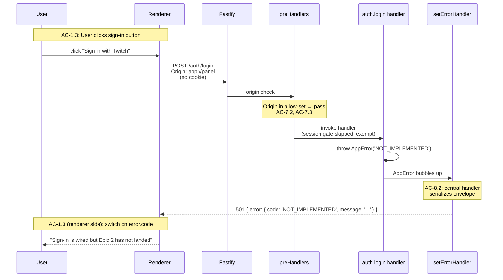
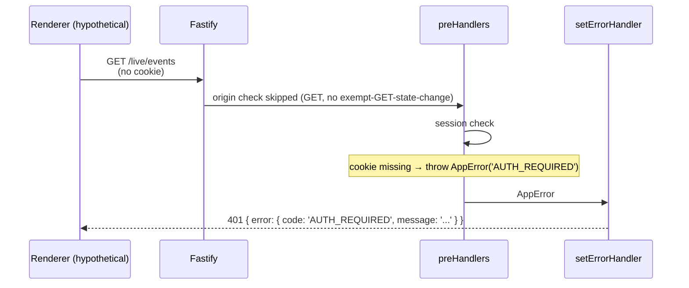
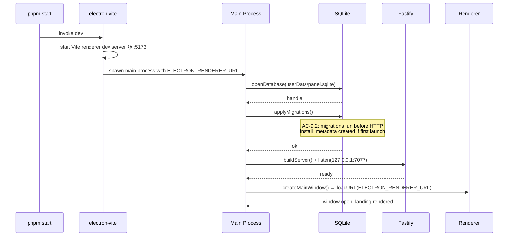

# Technical Design: Epic 1 — Server Companion

This companion carries implementation depth for the `apps/panel/server/` package — the Electron main process and everything it owns: the Fastify server, the central route registrar, the Origin + session gate stack, the typed error envelope, the SSE heartbeat, the Data Layer (SQLite + Drizzle), the baseline migration, packaging, and CI. The package is named `server` per the epic's AC-3.4 vocabulary; inside this process, the Fastify HTTP server runs on top of Electron's **main process** (an Electron-specific term, distinct from the package name).

Cross-references back to the index ([`tech-design.md`](./tech-design.md)) keep requirement traceability intact. Every section tags the ACs it serves; the test plan ([`test-plan.md`](./test-plan.md)) holds the per-file TC table.

---

## Table of Contents

- [Workspace Layout](#workspace-layout)
- [Electron Shell](#electron-shell)
- [Packaging](#packaging)
- [Fastify Bootstrap](#fastify-bootstrap)
- [Central Registrar](#central-registrar)
- [Server Binding](#server-binding)
- [Origin Validation](#origin-validation)
- [Session Gate](#session-gate)
- [Error Model](#error-model)
- [Routes](#routes)
- [SSE](#sse)
- [Data Layer](#data-layer)
- [Baseline Migration](#baseline-migration)
- [Window Management](#window-management)
- [CI](#ci)
- [Flows](#flows)
- [Interface Definitions](#interface-definitions)

---

## Workspace Layout

The workspace is a pnpm 10 monorepo with three packages under `apps/panel/`: `server`, `client`, and `shared`. Root-level config drives tooling; packages carry code. Package names match the epic's AC-3.3 / AC-3.4 vocabulary (`pnpm --filter client dev`, `pnpm --filter server dev`).

### Root Files

```
package.json              # workspace config, top-level scripts
pnpm-workspace.yaml       # workspace membership
electron.vite.config.ts   # electron-vite dev-mode config
electron-builder.yml      # packaging config
biome.json                # lint + format
tsconfig.base.json        # shared TS config; per-package extends
.github/workflows/ci.yml  # CI workflow (Story 9)
```

**`pnpm-workspace.yaml`:**

```yaml
packages:
  - 'apps/panel/*'
```

**Root `package.json` scripts** (story-parity with CI — AC-5.4):

```json
{
  "name": "streaming-control-panel",
  "private": true,
  "packageManager": "pnpm@10.x",
  "scripts": {
    "start": "electron-vite dev",
    "dev": "electron-vite dev",
    "build": "electron-vite build && pnpm --filter client build",
    "package": "electron-vite build && electron-builder",
    "lint": "biome check .",
    "lint:fix": "biome check --apply .",
    "format:check": "biome format .",
    "format:fix": "biome format --write .",
    "typecheck": "pnpm -r typecheck",
    "test": "pnpm -r test",
    "test:e2e": "playwright test",
    "red-verify": "pnpm format:check && pnpm lint && pnpm typecheck",
    "verify": "pnpm red-verify && pnpm test",
    "green-verify": "pnpm verify && pnpm guard:no-test-changes",
    "verify-all": "pnpm verify && pnpm test:e2e",
    "guard:no-test-changes": "node scripts/guard-no-test-changes.mjs",
    "postinstall": "electron-builder install-app-deps"
  }
}
```

The `postinstall` hook invokes `electron-builder install-app-deps`, which internally uses `@electron/rebuild` 4.0.3 to rebuild native modules (notably `better-sqlite3`) against Electron 41's Node ABI. Belt-and-suspenders with electron-builder's own `npmRebuild: true` at package time.

**Staged delivery of `test:e2e`:** Story 0 ships the placeholder below so `verify-all` is a real command from day one. Story 5 replaces the script with `playwright test` (as shown above) when the Playwright harness and 17 baseline screenshots land.

**`scripts/test-e2e-placeholder.mjs`** (Story 0 through Story 4):

```js
console.log('SKIP: Playwright e2e suite not yet implemented — first suite lands in Story 5 (D3)');
process.exit(0);
```

Story 5 deletes this file and updates the `test:e2e` script to `playwright test`.

**`scripts/guard-no-test-changes.mjs`** (Story 4, first story with TDD):

```js
import { execFileSync } from 'node:child_process';
import { existsSync, readFileSync } from 'node:fs';
if (!existsSync('.red-ref')) { console.log('guard: no .red-ref file; skipping'); process.exit(0); }
const redRef = readFileSync('.red-ref', 'utf8').trim();
const changed = execFileSync('git', ['diff', '--name-only', `${redRef}..HEAD`]).toString()
  .split('\n').filter(n => n.match(/\.test\.tsx?$/));
if (changed.length) { console.error(`guard: test files changed since Red (${redRef}):\n  ${changed.join('\n  ')}`); process.exit(1); }
console.log('guard: no test file changes since Red commit');
```

### Package: `apps/panel/server/`

```
apps/panel/server/
├── package.json
├── tsconfig.json
├── src/
│   ├── index.ts                     # entry: starts server + Electron
│   ├── electron/
│   │   ├── app.ts                   # app.whenReady, lifecycle, app:// protocol
│   │   └── window.ts                # BrowserWindow factory
│   ├── server/
│   │   ├── buildServer.ts           # Fastify factory
│   │   ├── registerRoute.ts         # central registrar (D5)
│   │   ├── errorHandler.ts          # setErrorHandler wire-up
│   │   └── config.ts                # server config constants + cookie secret resolution
│   ├── gate/
│   │   ├── originPreHandler.ts      # Origin allow-set check
│   │   └── sessionPreHandler.ts     # iron-session cookie check
│   ├── routes/
│   │   ├── auth.ts                  # POST /auth/login stub (Story 2)
│   │   ├── oauthCallback.ts         # GET /oauth/callback stub (Story 2)
│   │   └── liveEvents.ts            # GET /live/events SSE (Story 2)
│   ├── sse/
│   │   └── heartbeat.ts             # heartbeat emitter
│   ├── data/
│   │   ├── db.ts                    # better-sqlite3 file opener
│   │   ├── migrate.ts               # Drizzle migration runner
│   │   └── schema/
│   │       └── installMetadata.ts   # Drizzle table definition
│   └── test/
│       ├── buildTestServer.ts       # test factory: Fastify app with in-memory SQLite
│       └── sealFixtureSession.ts    # helper to mint a sealed cookie for Epic 2+ positive tests
└── drizzle/
    └── 0001_install_metadata.sql    # baseline migration SQL
```

### Package: `apps/panel/shared/`

```
apps/panel/shared/
├── package.json
├── tsconfig.json
└── src/
    ├── index.ts
    ├── errors/
    │   ├── codes.ts                 # const map of error codes → HTTP status
    │   ├── AppError.ts              # AppError class
    │   └── envelope.ts              # Zod schema for { error: { code, message } }
    ├── http/
    │   ├── paths.ts                 # route path constants
    │   └── gateExempt.ts            # GATE_EXEMPT_PATHS frozen array
    └── sse/
        └── events.ts                # Zod schemas for SSE event envelope + heartbeat
```

**`shared/package.json` name: `@panel/shared`**. Imported via the `workspace:*` protocol in `server` and `client`.

---

## Electron Shell

Electron 41 hosts the Fastify server inside its main process and the React renderer inside a single primary BrowserWindow. Story 7 wires these together; Story 8 packages them.

### App Lifecycle (`src/electron/app.ts`)

The main process entry (`src/index.ts`) has two responsibilities in order:

1. **Start the Fastify server** first (binds `127.0.0.1:7077`, applies migrations).
2. **Start Electron** (create BrowserWindow, register `app://` protocol, load the renderer).

Server starts first so the renderer never races against an unready server. Migrations (Story 3) run synchronously during server start; Fastify does not accept requests until migrations complete (AC-9.2).

```typescript
// src/index.ts
import { startServer } from './server/buildServer.js';
import { startElectron } from './electron/app.js';

const server = await startServer();
await startElectron({ serverUrl: server.url });
```

`startElectron` awaits Electron's `app.whenReady()` before creating the BrowserWindow. In dev mode, the renderer loads from Vite's dev server (electron-vite injects the URL via `ELECTRON_RENDERER_URL`). In production, the renderer loads from `app://panel/index.html` — see §Window Management.

### `app://` Protocol (D3)

Production renderer is served by a custom `app://` protocol registered during `app.whenReady`. This is what guarantees the `Origin` header on every renderer request (covered in §Origin Validation).

```typescript
import { protocol, net } from 'electron';
import { pathToFileURL } from 'node:url';
import path from 'node:path';

// After electron-vite build: __dirname is `dist/main/electron/`; renderer output is `dist/renderer/`
// (sibling of `dist/main/`, not child). So we need two levels up, then into renderer.
const RENDERER_ROOT = path.join(__dirname, '../../renderer');

protocol.registerSchemesAsPrivileged([
  { scheme: 'app', privileges: { standard: true, secure: true, supportFetchAPI: true, corsEnabled: false } },
]);

app.whenReady().then(() => {
  protocol.handle('app', (request) => {
    const url = new URL(request.url);
    const filePath = path.join(RENDERER_ROOT, url.pathname === '/' ? '/index.html' : url.pathname);
    return net.fetch(pathToFileURL(filePath).toString());
  });
  createMainWindow();
});
```

The `standard: true` privilege is what makes Chromium treat `app://panel` as a real origin (not `null`), so every `fetch()` the renderer makes to `http://127.0.0.1:7077` carries `Origin: app://panel` in the request headers. This closes the gap that `file://` URLs leave (per tech arch Open Question, `file://` resolves to `Origin: null`).

### ACs Covered

AC-1.1, AC-3.1, AC-3.2, AC-4.1, AC-4.2 (Story 7 and Story 8).

---

## Packaging

Decision D1: electron-vite 5 for dev HMR; electron-builder 26.8 for production packaging; `@electron/rebuild` 4.0.3 for native rebuild.

### electron-vite Config (`electron.vite.config.ts`)

```typescript
import { defineConfig, externalizeDepsPlugin } from 'electron-vite';
import react from '@vitejs/plugin-react';
import path from 'node:path';

export default defineConfig({
  main: {
    plugins: [externalizeDepsPlugin()],
    resolve: { alias: { '@panel/shared': path.resolve(__dirname, 'apps/panel/shared/src') } },
    build: { outDir: 'dist/main', rollupOptions: { input: 'apps/panel/server/src/index.ts' } },
  },
  preload: {
    // Epic 1 ships no preload script; keep the slot so later epics can add IPC if truly necessary.
    plugins: [externalizeDepsPlugin()],
    build: { outDir: 'dist/preload' },
  },
  renderer: {
    root: 'apps/panel/client',
    plugins: [react()],
    resolve: { alias: { '@panel/shared': path.resolve(__dirname, 'apps/panel/shared/src') } },
    build: { outDir: '../../../dist/renderer' },
  },
});
```

`externalizeDepsPlugin()` keeps native modules (`better-sqlite3`) and other Node built-ins out of the Rollup bundle, so they resolve at runtime against the installed node_modules. Critical for `better-sqlite3`.

### electron-builder Config (`electron-builder.yml`)

```yaml
appId: com.streamingpanel.app
productName: Streaming Control Panel
directories:
  output: dist/packaged
  buildResources: build-resources
files:
  - dist/main/**
  - dist/preload/**
  - dist/renderer/**
  - node_modules/**
  - package.json
asar: true
asarUnpack:
  - "**/*.node"         # better-sqlite3 native binary
  - "node_modules/better-sqlite3/**/*"
npmRebuild: true        # forces @electron/rebuild before packaging
win:
  target:
    - nsis
mac:
  target:
    - dir               # Epic 1: unsigned host-OS build only
    - dmg
linux:
  target:
    - AppImage
```

Per AC-4.1, the packaged artifact format is host-OS-appropriate. Cross-OS installers and code signing are out of Epic 1 scope (deferred to post-M3 release engineering).

### Native Rebuild Pipeline

```
pnpm install
   └── postinstall
       └── electron-builder install-app-deps
           └── @electron/rebuild → rebuild better-sqlite3 for Electron 41's ABI

pnpm package
   └── electron-vite build
   └── electron-builder
       └── npmRebuild: true → @electron/rebuild (belt-and-suspenders)
       └── asar pack with asarUnpack exclusion for *.node
       └── per-OS installer output
```

If the dev installs the repo fresh and `pnpm start` fails with a `NODE_MODULE_VERSION` mismatch, the remediation is `pnpm rebuild` (which re-invokes the postinstall). This is covered in the README dev-mode section (AC-3.5).

### ACs Covered

AC-3.1 (dev mode), AC-3.2 (HMR), AC-3.5 (README documentation), AC-4.1, AC-4.2, AC-4.3 (packaging).

---

## Fastify Bootstrap

`buildServer.ts` is a factory that returns an unstarted Fastify instance plus a `start()` function. Tests import the factory and call `app.inject()` without ever binding to a port. Story 7 starts the server for real.

```typescript
// src/server/buildServer.ts
import Fastify, { FastifyInstance } from 'fastify';
import fastifyCookie from '@fastify/cookie';
import { ZodTypeProvider, validatorCompiler, serializerCompiler } from 'fastify-type-provider-zod';
import { loadConfig } from './config.js';
import { registerErrorHandler } from './errorHandler.js';
import { registerAuthRoutes } from '../routes/auth.js';
import { registerOauthCallbackRoute } from '../routes/oauthCallback.js';
import { registerLiveEventsRoute } from '../routes/liveEvents.js';
import { openDatabase, applyMigrations } from '../data/db.js';

export interface BuildServerOptions {
  /** Override config values for tests. */
  config?: Partial<ReturnType<typeof loadConfig>>;
  /** Use an in-memory SQLite instance instead of the userData path. */
  inMemoryDb?: boolean;
}

export async function buildServer(options: BuildServerOptions = {}) {
  const config = { ...loadConfig(), ...options.config };

  const db = await openDatabase(options.inMemoryDb ? ':memory:' : config.databasePath);
  await applyMigrations(db);

  const app: FastifyInstance = Fastify({
    logger: { level: 'info' },
  }).withTypeProvider<ZodTypeProvider>();

  app.setValidatorCompiler(validatorCompiler);
  app.setSerializerCompiler(serializerCompiler);
  registerErrorHandler(app);

  await app.register(fastifyCookie, { secret: config.cookieSecret });

  registerAuthRoutes(app);
  registerOauthCallbackRoute(app);
  registerLiveEventsRoute(app);

  return { app, db, config };
}

export async function startServer(): Promise<{ url: string; close: () => Promise<void> }> {
  const { app, config } = await buildServer();
  await app.listen({ host: '127.0.0.1', port: config.port });
  return {
    url: `http://127.0.0.1:${config.port}`,
    close: () => app.close(),
  };
}
```

### Plugin Registration Order

Order matters. Fastify registers plugins and routes in declaration order, and preHandlers apply in declaration order per route. The order above — cookie → error handler → routes (which internally register Origin + session preHandlers via the registrar) — produces the stack documented in §Flows.

### ACs Covered

AC-7.1 (binding), AC-8.2 (central error handler registered via `setErrorHandler`).

---

## Central Registrar

Decision D5: `registerRoute(app, spec)` composes Origin validation and session gating automatically from a declarative route spec. This is what satisfies AC-2.5a — a new route registered through this registrar inherits the gate without any per-route gate code.

### The Spec Shape

```typescript
// src/server/registerRoute.ts
import { FastifyInstance, RouteOptions } from 'fastify';
import { originPreHandler } from '../gate/originPreHandler.js';
import { sessionPreHandler } from '../gate/sessionPreHandler.js';
import { GATE_EXEMPT_PATHS } from '@panel/shared';

export interface RouteSpec extends Omit<RouteOptions, 'preHandler'> {
  /** If true, skip the session gate. Must be in GATE_EXEMPT_PATHS. */
  exempt?: boolean;
  /** Extra per-route preHandlers, run after Origin + session. */
  preHandler?: RouteOptions['preHandler'];
}

export function registerRoute(app: FastifyInstance, spec: RouteSpec): void {
  // Safety check: exempt routes must be in the shared frozen list (AC-2.3)
  if (spec.exempt && !GATE_EXEMPT_PATHS.includes(spec.url)) {
    throw new Error(
      `registerRoute: route ${spec.url} is marked exempt but not in GATE_EXEMPT_PATHS. ` +
      `Add it to apps/panel/shared/src/http/gateExempt.ts if this is intentional.`
    );
  }

  const stateMutating = ['POST', 'PUT', 'PATCH', 'DELETE'].includes(
    (Array.isArray(spec.method) ? spec.method[0] : spec.method).toUpperCase()
  );

  const preHandlers = [
    ...(stateMutating ? [originPreHandler] : []),
    ...(!spec.exempt ? [sessionPreHandler] : []),
    ...(Array.isArray(spec.preHandler) ? spec.preHandler : spec.preHandler ? [spec.preHandler] : []),
  ];

  app.route({ ...spec, preHandler: preHandlers });
}
```

### Registration Example

Route files call `registerRoute`, never `app.get()` / `app.post()` directly:

```typescript
// src/routes/auth.ts
import { FastifyInstance } from 'fastify';
import { registerRoute } from '../server/registerRoute.js';
import { AppError } from '@panel/shared';
import { PATHS } from '@panel/shared';

export function registerAuthRoutes(app: FastifyInstance) {
  registerRoute(app, {
    method: 'POST',
    url: PATHS.auth.login,          // '/auth/login'
    exempt: true,                    // in GATE_EXEMPT_PATHS per D5's safety check
    handler: async () => {
      throw new AppError('NOT_IMPLEMENTED', 'Sign-in lands with Epic 2 (Twitch OAuth & Tenant Onboarding).');
    },
  });
}
```

### Why a Helper and Not a Plugin

A Fastify plugin that auto-applies global preHandlers to every route is an alternative. The helper approach wins for Epic 1 because:

1. **Exempt-list correctness is explicit.** The registrar's safety check catches the "exempt: true but not in the shared list" mistake at registration time, not at request time.
2. **The state-mutating → Origin-required coupling is locally visible.** A plugin that applies Origin globally could surprise a GET route author; this registrar shows the decision in one file.
3. **It satisfies TC-2.5a directly.** "New server route registered without any gate-related code" means calling `registerRoute(app, { method, url, handler })` — the call site carries zero gate syntax.

### ACs Covered

AC-2.3 (exempt list safety check), AC-2.5a (default-gated inheritance), AC-6.2 (auth.login handler shape), AC-7.2 (Origin preHandler ordering), AC-8.2 (central wiring).

---

## Server Binding

Fastify binds to `127.0.0.1:7077` per AC-7.1 and D2. Port and host are constants — not configurable. The override surface is deferred (index §Open Questions Q1) until a real collision is observed.

```typescript
// src/server/config.ts
export const PANEL_PORT = 7077;
export const PANEL_HOST = '127.0.0.1';

export interface ServerConfig {
  readonly port: typeof PANEL_PORT;
  readonly host: typeof PANEL_HOST;
  databasePath: string;
  allowedOrigins: readonly string[];
  cookieSecret: string;
}

export function loadConfig(): ServerConfig {
  return {
    port: PANEL_PORT,
    host: PANEL_HOST,
    databasePath: resolveUserDataDbPath(),
    allowedOrigins: resolveAllowedOrigins(),
    cookieSecret: resolveCookieSecret(),
  };
}
```

The port as a const literal also documents the Twitch-redirect-URI coupling: `http://localhost:7077/oauth/callback` registered in the Twitch dev console must match this value exactly. If a future epic introduces a port-override surface, it also takes on the responsibility of threading that override into the Twitch dev-app registration and the renderer's fetch target.

### `resolveUserDataDbPath()`

```typescript
import { app } from 'electron';
import path from 'node:path';

export function resolveUserDataDbPath(): string {
  // app.getPath('userData') returns the OS-correct user data directory:
  //   Windows: %APPDATA%/<productName>
  //   macOS:   ~/Library/Application Support/<productName>
  //   Linux:   ~/.config/<productName>
  return path.join(app.getPath('userData'), 'panel.sqlite');
}
```

In test mode, `buildServer({ inMemoryDb: true })` bypasses this path and opens `:memory:`.

### `resolveCookieSecret()`

Epic 1 uses a deterministic development secret plus an env-var override. Story 4 establishes this; Epic 2 layers real secret management on top.

```typescript
function resolveCookieSecret(): string {
  const fromEnv = process.env.PANEL_COOKIE_SECRET;
  if (fromEnv && fromEnv.length >= 32) return fromEnv;
  // Epic 1 dev default — 32+ bytes required by iron-session. Replaced in Epic 2 with
  // a keychain-backed per-install secret.
  return 'dev-only-change-in-epic-2-___________';
}
```

### ACs Covered

AC-7.1.

---

## Origin Validation

Decision D3: production renderer loads via `app://panel`. Allowed origin set:

```typescript
// src/server/config.ts (continued)
function resolveAllowedOrigins(): readonly string[] {
  const devOrigins = [
    'http://localhost:5173',   // Vite dev server default
    'http://127.0.0.1:5173',
  ];
  const prodOrigins = ['app://panel'];
  return [...devOrigins, ...prodOrigins] as const;
}
```

### The preHandler

Runs before the session gate on state-changing routes. Exempt routes that are state-changing (`POST /auth/login`) still run through Origin validation — this is what AC-7.2 and TC-6.2b require.

```typescript
// src/gate/originPreHandler.ts
import { FastifyRequest, FastifyReply } from 'fastify';
import { AppError } from '@panel/shared';

export async function originPreHandler(
  req: FastifyRequest,
  _reply: FastifyReply,
): Promise<void> {
  const origin = req.headers.origin;
  const { allowedOrigins } = req.server.config; // decorated at bootstrap

  if (!origin) {
    throw new AppError('ORIGIN_REJECTED', 'Request is missing Origin header.');
  }
  if (!allowedOrigins.includes(origin)) {
    throw new AppError('ORIGIN_REJECTED', `Origin ${origin} is not in the allowed set.`);
  }
}
```

`req.server.config` is available via a Fastify `decorate`:

```typescript
// in buildServer.ts after loadConfig:
app.decorate('config', config);
```

### Ordering Guarantee

Per §Central Registrar, `registerRoute` orders preHandlers as `[origin?, session?, ...custom]`. On a state-changing gated route with a missing Origin and missing session cookie, Origin runs first, throws `ORIGIN_REJECTED`, and the session check never runs. This is what TC-7.4a asserts.

### ACs Covered

AC-7.2, AC-7.3, AC-7.4, AC-8.1b.

---

## Session Gate

Decision D4: iron-session 8 + @fastify/cookie 11, default-gated preHandler with exempt list from `@panel/shared`.

### Staged Delivery Across Stories

The gate ships in two stages to keep Story 1's TC-2.5a ("new route inherits gate") testable before iron-session lands in Story 4:

- **Story 1 lands a stub `sessionPreHandler`** at `src/gate/sessionPreHandler.ts` that unconditionally throws `AppError('AUTH_REQUIRED', 'stub: real session gate lands in Story 4')`. The registrar wires it identically to the final version. TC-2.5a passes because any gated route registered in Story 1 returns 401 through this stub.
- **Story 4 replaces the stub body** with the real iron-session implementation shown below. The preHandler signature and module path do not change. Story 4 also installs `@fastify/cookie` and iron-session as dependencies, wires the cookie plugin in `buildServer`, and lands the `sealFixtureSession()` test helper.

The stub → real swap does not require any test file to change. Tests authored against the stub in Story 1 (including TC-2.5a) continue to pass unchanged when Story 4 replaces the body, because the "no cookie → 401" contract is the same in both stages. Tests that require a *valid* session (none in Epic 1) would land in Story 4 with the real implementation.

### The preHandler

```typescript
// src/gate/sessionPreHandler.ts
import { FastifyRequest, FastifyReply } from 'fastify';
import { unsealData } from 'iron-session';
import { AppError } from '@panel/shared';

const SESSION_COOKIE_NAME = 'panel_session';

export interface SessionPayload {
  broadcasterId: string;       // populated in Epic 2
  issuedAt: number;
}

export async function sessionPreHandler(
  req: FastifyRequest,
  _reply: FastifyReply,
): Promise<void> {
  const cookie = req.cookies[SESSION_COOKIE_NAME];
  if (!cookie) {
    throw new AppError('AUTH_REQUIRED', 'Request requires an authenticated session.');
  }

  try {
    const payload = await unsealData<SessionPayload>(cookie, {
      password: req.server.config.cookieSecret,
    });
    (req as FastifyRequest & { session?: SessionPayload }).session = payload;
  } catch (err) {
    // unsealData throws on missing password, tampered cookie, or expired TTL
    throw new AppError('AUTH_REQUIRED', 'Session cookie is invalid or expired.');
  }
}
```

### Exempt List (`@panel/shared`)

```typescript
// apps/panel/shared/src/http/gateExempt.ts
import { PATHS } from './paths.js';

export const GATE_EXEMPT_PATHS: readonly string[] = Object.freeze([
  PATHS.auth.login,        // '/auth/login'
  PATHS.oauth.callback,    // '/oauth/callback'
]);
```

Frozen array + readonly tuple satisfies TC-2.3a's "unit test reads the exempt list." The test does `expect(GATE_EXEMPT_PATHS).toEqual(['/auth/login', '/oauth/callback'])` — trivial.

### Epic 1 Session Issuance: None

No route in Epic 1 ever calls `sealData`. The gate is installed and tests the 401 branch (TC-2.2a, TC-6.3b). The positive branch (gate lets a real session through) requires a sealed cookie. That becomes relevant in Epic 2.

### Test Helper for Epic 2 (Installed Now)

```typescript
// src/test/sealFixtureSession.ts
import { sealData } from 'iron-session';

export interface SealFixtureOptions {
  password?: string;
  broadcasterId?: string;
  issuedAt?: number;
  ttlSeconds?: number;
}

export async function sealFixtureSession(options: SealFixtureOptions = {}): Promise<string> {
  return sealData(
    {
      broadcasterId: options.broadcasterId ?? 'test-broadcaster-id',
      issuedAt: options.issuedAt ?? Date.now(),
    },
    {
      password: options.password ?? 'dev-only-change-in-epic-2-___________',
      ttl: options.ttlSeconds ?? 7 * 24 * 3600,
    },
  );
}
```

Epic 1 tests don't call this. The helper is in place so Epic 2's first positive-path test doesn't require inventing the session-seal pattern from scratch.

### ACs Covered

AC-2.2, AC-2.3, AC-6.3b, AC-8.1a.

---

## Error Model

Decision D12: error code registry is a typed `const` map with both runtime behavior and compile-time exhaustiveness. Shape:

### Registry (`@panel/shared`)

```typescript
// apps/panel/shared/src/errors/codes.ts
export const ERROR_CODES = {
  AUTH_REQUIRED:    { status: 401, defaultMessage: 'Authenticated session required.' },
  ORIGIN_REJECTED:  { status: 403, defaultMessage: 'Request origin is not allowed.' },
  INPUT_INVALID:    { status: 400, defaultMessage: 'Request validation failed.' },
  NOT_IMPLEMENTED:  { status: 501, defaultMessage: 'This route is not yet implemented.' },
  SERVER_ERROR:     { status: 500, defaultMessage: 'An unexpected server error occurred.' },
} as const;

export type ErrorCode = keyof typeof ERROR_CODES;
```

### `AppError` Class

```typescript
// apps/panel/shared/src/errors/AppError.ts
import { ERROR_CODES, type ErrorCode } from './codes.js';

export class AppError extends Error {
  public readonly code: ErrorCode;
  public readonly status: number;

  constructor(code: ErrorCode, message?: string) {
    super(message ?? ERROR_CODES[code].defaultMessage);
    this.code = code;
    this.status = ERROR_CODES[code].status;
    this.name = 'AppError';
  }
}
```

### Envelope Schema (shared with renderer)

```typescript
// apps/panel/shared/src/errors/envelope.ts
import { z } from 'zod';
import { ERROR_CODES } from './codes.js';

const errorCodeSchema = z.enum(Object.keys(ERROR_CODES) as [keyof typeof ERROR_CODES]);

export const errorEnvelopeSchema = z.object({
  error: z.object({
    code: errorCodeSchema,
    message: z.string().min(1),
  }),
});

export type ErrorEnvelope = z.infer<typeof errorEnvelopeSchema>;
```

### Central Error Handler (`setErrorHandler`)

```typescript
// src/server/errorHandler.ts
import { FastifyInstance, FastifyError } from 'fastify';
import { AppError, ERROR_CODES } from '@panel/shared';

export function registerErrorHandler(app: FastifyInstance): void {
  app.setErrorHandler((error, request, reply) => {
    if (error instanceof AppError) {
      reply.status(error.status).send({ error: { code: error.code, message: error.message } });
      return;
    }

    // Zod validation error from type-provider-zod
    if ((error as FastifyError).validation) {
      reply.status(400).send({
        error: { code: 'INPUT_INVALID', message: 'Request validation failed.' },
      });
      return;
    }

    // Unknown error → SERVER_ERROR; never leak stack into message
    request.log.error({ err: error }, 'unhandled error');
    reply.status(500).send({
      error: { code: 'SERVER_ERROR', message: ERROR_CODES.SERVER_ERROR.defaultMessage },
    });
  });
}
```

### Why Typed `const` Map (Not Discriminated Union, Not String Enum)

Three alternatives were considered for the registry shape (Epic Q3):

- **Discriminated union of `{ code: 'X' } | { code: 'Y' }`** — forces pattern-match on construction. Over-engineered when every code has identical shape.
- **String enum** — loses exhaustiveness on the renderer side unless every switch declares every case. Fine, but the `const` map subsumes it.
- **Typed `const` map (chosen)** — `ERROR_CODES` is a real object at runtime (iterable for "registry contains starter set" tests), a type source via `keyof typeof`, and carries the HTTP-status mapping without a second lookup table.

### ACs Covered

AC-8.1 (every non-2xx envelope shape), AC-8.2 (central handler), AC-8.3 (registry starter set).

---

## Routes

Epic 1 registers three routes. All three are stubs; Stories 2 and 4 deliver them.

### `POST /auth/login` (Story 2)

```typescript
// src/routes/auth.ts
import { FastifyInstance } from 'fastify';
import { registerRoute } from '../server/registerRoute.js';
import { AppError, PATHS } from '@panel/shared';

export function registerAuthRoutes(app: FastifyInstance) {
  registerRoute(app, {
    method: 'POST',
    url: PATHS.auth.login,
    exempt: true,                  // exempt from session gate; Origin still applies
    handler: async () => {
      throw new AppError(
        'NOT_IMPLEMENTED',
        'Sign-in is wired but Epic 2 (Twitch OAuth & Tenant Onboarding) has not yet landed.',
      );
    },
  });
}
```

Exempt from the session gate (the route is *how* a session would be established); Origin-checked because it's state-changing. `POST` with a bad Origin produces 403 `ORIGIN_REJECTED` (TC-6.2b). `POST` with a good Origin produces 501 `NOT_IMPLEMENTED` (TC-6.2a).

### `GET /oauth/callback` (Story 2)

```typescript
// src/routes/oauthCallback.ts
import { FastifyInstance } from 'fastify';
import { registerRoute } from '../server/registerRoute.js';
import { AppError, PATHS } from '@panel/shared';

export function registerOauthCallbackRoute(app: FastifyInstance) {
  registerRoute(app, {
    method: 'GET',
    url: PATHS.oauth.callback,
    exempt: true,                  // exempt from session gate
    handler: async () => {
      throw new AppError('NOT_IMPLEMENTED', 'OAuth callback lands with Epic 2.');
    },
  });
}
```

GET is not state-changing, so no Origin preHandler applies (TC-7.3a). The route is exempt from the session gate because the OAuth callback arrives on an unauthenticated browser redirect (the session doesn't yet exist at this point in the flow).

### ACs Covered

AC-6.1 (callback stub), AC-6.2 (login stub), AC-8.1c (501 envelope shape).

---

## SSE

`GET /live/events` is a Server-Sent Events endpoint session-gated and emitting only a `heartbeat` event in Epic 1 (D10: interval 15 seconds).

### Handler

```typescript
// src/routes/liveEvents.ts
import { FastifyInstance } from 'fastify';
import { registerRoute } from '../server/registerRoute.js';
import { PATHS } from '@panel/shared';

const HEARTBEAT_INTERVAL_MS = 15_000;

export function registerLiveEventsRoute(app: FastifyInstance) {
  registerRoute(app, {
    method: 'GET',
    url: PATHS.live.events,
    // not exempt → session gate applies, returns 401 unauthenticated
    handler: async (req, reply) => {
      // SSE response headers
      reply.raw.writeHead(200, {
        'Content-Type': 'text/event-stream',
        'Cache-Control': 'no-cache',
        'Connection': 'keep-alive',
        'X-Accel-Buffering': 'no',
      });

      const send = (type: string, data: unknown) => {
        reply.raw.write(`event: ${type}\n`);
        reply.raw.write(`data: ${JSON.stringify({ type, data })}\n\n`);
      };

      // Initial heartbeat immediately on connect (supports test-time advancement)
      send('heartbeat', {});

      const interval = setInterval(() => send('heartbeat', {}), HEARTBEAT_INTERVAL_MS);

      req.raw.on('close', () => {
        clearInterval(interval);
      });

      return reply; // Keep the connection open
    },
  });
}
```

### SSE Event Envelope (`@panel/shared`)

```typescript
// apps/panel/shared/src/sse/events.ts
import { z } from 'zod';

export const heartbeatEventSchema = z.object({
  type: z.literal('heartbeat'),
  data: z.object({}),
});

export const sseEventSchema = z.discriminatedUnion('type', [heartbeatEventSchema]);
export type SseEvent = z.infer<typeof sseEventSchema>;
```

Epic 4a extends the discriminated union with `ChatMessage`, `ViewerCount`, etc. Epic 1's schema is the seam.

### Why Manual SSE (Not `@fastify/sse-v2`)

Per Open Question Q2 in the index: the manual pattern is ~20 lines and has no subscriber fan-out in Epic 1 (one renderer, one connection). A plugin is worth adopting when real event producers arrive and multi-subscriber fan-out or reconnect semantics become non-trivial. Epic 4a revisits.

### Test-Time Advancement (TC-6.3a)

Vitest's `vi.useFakeTimers()` advances `setInterval`. A buildTestServer helper passes `{ timerMode: 'fake' }` to let tests drive heartbeat cadence deterministically.

### ACs Covered

AC-6.3 (heartbeat cadence), AC-6.3b (unauth rejection via session gate), AC-6.4 (shared SSE envelope).

---

## Data Layer

### Opening the SQLite File

```typescript
// src/data/db.ts
import Database from 'better-sqlite3';
import { drizzle, BetterSQLite3Database } from 'drizzle-orm/better-sqlite3';
import { migrate } from 'drizzle-orm/better-sqlite3/migrator';
import path from 'node:path';

export type PanelDb = BetterSQLite3Database;

export async function openDatabase(filePath: string): Promise<PanelDb> {
  const sqlite = new Database(filePath);
  sqlite.pragma('journal_mode = WAL');
  sqlite.pragma('foreign_keys = ON');
  return drizzle(sqlite);
}

export async function applyMigrations(db: PanelDb): Promise<void> {
  const migrationsFolder = path.join(__dirname, '../../drizzle');
  migrate(db, { migrationsFolder });
}
```

`journal_mode = WAL` is better for the read-while-writing pattern that comes online in Epic 4a (live event consumers reading chatters while the welcome bot writes). Epic 1 doesn't need it but setting it up now is free.

### Story 3 Packaging Validation (AC-9.3)

The first `pnpm install && pnpm start` on the developer's host OS validates that `@electron/rebuild` successfully rebuilt `better-sqlite3` against Electron's Node ABI. Concrete failure mode: `pnpm start` crashes with `NODE_MODULE_VERSION mismatch`. Remediation: `pnpm rebuild`. Documented in README.

### ACs Covered

AC-9.1 (file at userData), AC-9.2 (migrations before HTTP), AC-9.3 (native rebuild).

---

## Baseline Migration

Decision D8: single-row `install_metadata` table. Sentinel via `PRAGMA user_version`.

### Schema (Drizzle definition)

```typescript
// src/data/schema/installMetadata.ts
import { sqliteTable, integer, text } from 'drizzle-orm/sqlite-core';

export const installMetadata = sqliteTable('install_metadata', {
  id: integer('id').primaryKey().default(1),
  schemaVersion: integer('schema_version').notNull(),
  createdAt: integer('created_at').notNull(),
  appVersion: text('app_version').notNull(),
});
```

### Baseline SQL (`drizzle/0001_install_metadata.sql`)

```sql
CREATE TABLE install_metadata (
    id                INTEGER PRIMARY KEY CHECK (id = 1),
    schema_version    INTEGER NOT NULL,
    created_at        INTEGER NOT NULL,
    app_version       TEXT    NOT NULL
);

INSERT INTO install_metadata (id, schema_version, created_at, app_version)
VALUES (1, 1, unixepoch() * 1000, '0.1.0');
```

### Sentinel Test Pattern (TC-9.1b)

```typescript
// in the test
const db1 = await openDatabase(tempFile);
await applyMigrations(db1);
await sql`PRAGMA user_version = 42`.run(db1);
db1.close();

const db2 = await openDatabase(tempFile);
const [[value]] = await sql`PRAGMA user_version`.all(db2);
expect(value).toBe(42);
```

### Why `install_metadata` Is Not a Feature Table

The epic's AC-9.4 says "no feature-specific tables (no tokens, no install binding, no commands, no chatters, no welcome state, no recent clips)." `install_metadata` is install-identity data, not a feature. It stays in Epic 1 because:

1. `schemaVersion` is how later migrations version-check.
2. `createdAt` + `appVersion` are useful forensic data.

It is *not* the install-binding table (which holds `broadcaster_id`); that arrives in Epic 2. Palette preference is not persisted here — it lives in renderer-side `localStorage` (D9) until server-backed preferences become meaningful in a later epic.

### ACs Covered

AC-9.4 (exactly one baseline migration), AC-9.1b (sentinel path — via PRAGMA, not a test-only table).

---

## Window Management

Epic 1 creates one BrowserWindow with native chrome (D14).

```typescript
// src/electron/window.ts
import { BrowserWindow } from 'electron';
import path from 'node:path';

export function createMainWindow(): BrowserWindow {
  const win = new BrowserWindow({
    width: 1280,
    height: 800,
    minWidth: 960,
    minHeight: 600,
    webPreferences: {
      contextIsolation: true,
      nodeIntegration: false,
      sandbox: true,
    },
  });

  if (process.env.ELECTRON_RENDERER_URL) {
    // Dev mode — Vite dev server
    win.loadURL(process.env.ELECTRON_RENDERER_URL);
  } else {
    // Production — custom app:// protocol
    win.loadURL('app://panel/index.html');
  }

  return win;
}
```

`contextIsolation: true` + `nodeIntegration: false` + `sandbox: true` is the modern Electron hardening default. Combined with the custom `app://` protocol registered with `secure: true, corsEnabled: false`, the renderer cannot reach the filesystem, cannot load remote URLs, and always carries a well-defined Origin.

### ACs Covered

AC-1.1 (one window), AC-3.1 (dev mode), AC-3.2 (HMR — Vite does this via `ELECTRON_RENDERER_URL`).

---

## CI

Story 9 delivers the workflow. Runs on Ubuntu, triggered on `pull_request` against `main`. Uses pnpm scripts to match local development (AC-5.4).

```yaml
# .github/workflows/ci.yml
name: CI
on:
  pull_request:
    branches: [main]

jobs:
  verify:
    runs-on: ubuntu-24.04
    steps:
      - uses: actions/checkout@v4
      - uses: pnpm/action-setup@v4
        with:
          version: 10
      - uses: actions/setup-node@v4
        with:
          node-version: '24'
          cache: 'pnpm'
      - run: pnpm install --frozen-lockfile
      - run: pnpm verify
```

### Merge-Gate Enforcement (AC-5.5)

Branch protection rule on `main`:
- "Require status checks to pass before merging"
- Required check: `CI / verify`

This is configured in GitHub settings, not in the workflow file. Story 9's README documents the setup.

### Absence of Packaging (AC-5.3)

No step in the workflow runs `pnpm package` or a release-publishing action. CI runs only `pnpm verify`. Per-OS installers and release automation are deferred post-M3.

### ACs Covered

AC-5.1 (PR trigger, Ubuntu), AC-5.2 (lint, typecheck, test), AC-5.3 (no release steps), AC-5.4 (script parity), AC-5.5 (merge gate, no main-push trigger).

---

## Flows

Three flows carry the load. Each connects the modules above in a sequence that serves specific ACs.

### Flow 1: First `POST /auth/login` from the Renderer

Covers AC-1.3, AC-6.2, AC-7.2, AC-8.1b, AC-8.1c.



**Skeleton Requirements for Story 2:**

| What | Where | Stub |
|------|-------|------|
| Auth routes module | `server/src/routes/auth.ts` | `export function registerAuthRoutes(app) { throw new NotImplementedError('registerAuthRoutes') }` |

**Implementation (Story 2 TDD Green):**

Delivers the handler body above. Origin preHandler ordering and test comes with Story 4 (TC-6.2b).

---

### Flow 2: Gated `GET /live/events` Unauthenticated → 401

Covers AC-2.2, AC-6.3b, AC-8.1a.



The renderer never actually issues this in Epic 1 because the renderer only reaches `/live/events` after a successful sign-in (which can't happen yet). But the route is registered and the 401 path is tested.

---

### Flow 3: Bootstrap Sequence (First `pnpm start`)

Covers AC-1.1, AC-3.1, AC-9.1, AC-9.2.



---

## Interface Definitions

Ground-level types and function signatures that Story 0 and Story 1 seed as stubs.

### `shared/src/http/paths.ts`

```typescript
export const PATHS = {
  auth: { login: '/auth/login' },
  oauth: { callback: '/oauth/callback' },
  liveEvents: '/live/events',
} as const;

export type PathValue = typeof PATHS[keyof typeof PATHS] | string;
```

### `shared/src/errors/AppError.ts`

```typescript
import { ERROR_CODES, type ErrorCode } from './codes.js';

export class AppError extends Error {
  public readonly code: ErrorCode;
  public readonly status: number;
  constructor(code: ErrorCode, message?: string);
}
```

### `server/src/server/buildServer.ts`

```typescript
export interface BuildServerOptions {
  config?: Partial<ServerConfig>;
  inMemoryDb?: boolean;
  timerMode?: 'real' | 'fake';
}

export interface BuildServerResult {
  app: FastifyInstance;
  db: PanelDb;
  config: ServerConfig;
}

export async function buildServer(options?: BuildServerOptions): Promise<BuildServerResult>;
export async function startServer(): Promise<{ url: string; close: () => Promise<void> }>;
```

### `server/src/server/registerRoute.ts`

```typescript
export interface RouteSpec extends Omit<RouteOptions, 'preHandler'> {
  exempt?: boolean;
  preHandler?: RouteOptions['preHandler'];
}

export function registerRoute(app: FastifyInstance, spec: RouteSpec): void;
```

### `server/src/gate/*.ts`

```typescript
export function originPreHandler(req: FastifyRequest, reply: FastifyReply): Promise<void>;

export interface SessionPayload {
  broadcasterId: string;
  issuedAt: number;
}
export function sessionPreHandler(req: FastifyRequest, reply: FastifyReply): Promise<void>;
```

### `server/src/data/db.ts`

```typescript
export type PanelDb = BetterSQLite3Database;
export function openDatabase(filePath: string): Promise<PanelDb>;
export function applyMigrations(db: PanelDb): Promise<void>;
```

### `server/src/data/schema/installMetadata.ts`

```typescript
export const installMetadata: SQLiteTableWithColumns<{
  name: 'install_metadata';
  columns: {
    id: SQLiteColumn<{ data: number; notNull: true }>;
    schemaVersion: SQLiteColumn<{ data: number; notNull: true }>;
    createdAt: SQLiteColumn<{ data: number; notNull: true }>;
    appVersion: SQLiteColumn<{ data: string; notNull: true }>;
  };
  schema: undefined;
  dialect: 'sqlite';
}>;
```

### `server/src/test/sealFixtureSession.ts`

```typescript
export interface SealFixtureOptions {
  password?: string;
  broadcasterId?: string;
  issuedAt?: number;
  ttlSeconds?: number;
}
export function sealFixtureSession(options?: SealFixtureOptions): Promise<string>;
```

---

## Related Documentation

- Index: [`tech-design.md`](./tech-design.md)
- Client companion: [`tech-design-client.md`](./tech-design-client.md)
- Test plan: [`test-plan.md`](./test-plan.md)
- UI spec: [`ui-spec.md`](./ui-spec.md)
- Epic: [`./epic.md`](./epic.md)
- Architecture: [`../architecture.md`](../architecture.md)
