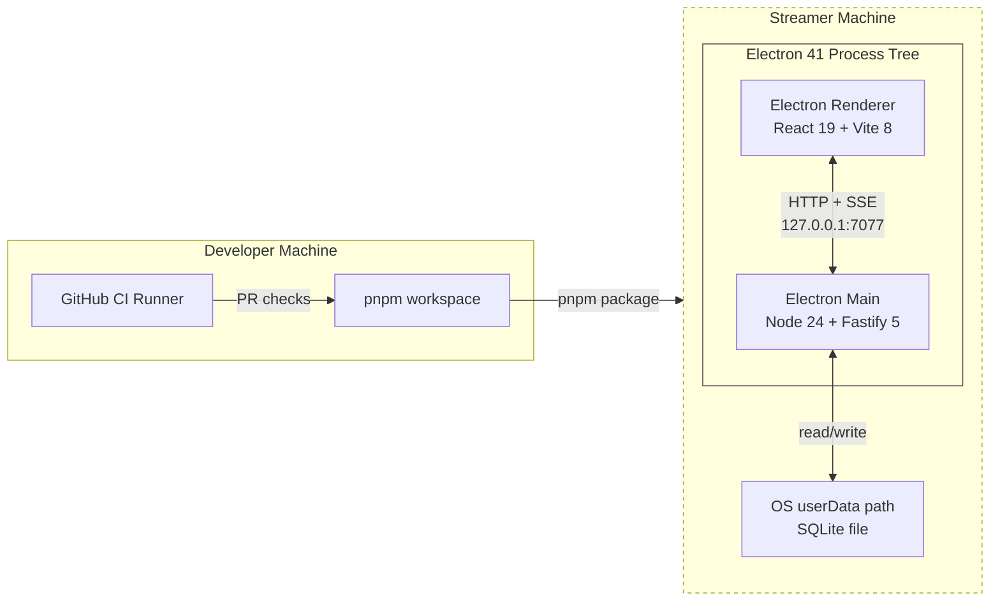
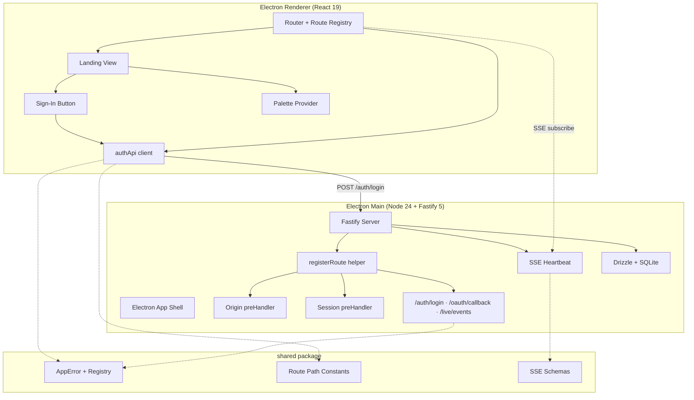

# Technical Design: Epic 1 — App Shell & Landing

## Purpose

This document is the **index** for Epic 1's tech design. It carries the decision record, spec validation, system view, module architecture overview, work breakdown, and deferred items. Implementation depth lives in two domain companions; the test plan and UI spec are separate artifacts.

| Audience | What they find here |
|----------|---------------------|
| Reviewer | Decisions, deviations from epic, and the full-system map |
| BA/SM | Work breakdown to shard into stories |
| Tech Lead | Enough depth to seed per-story technical sections; companions for the rest |
| Engineer | Entry points, then jumps to the relevant companion |

**Prerequisites:** Epic 1 (`./epic.md`), PRD (`../prd.md`), Technical Architecture (`../architecture.md`). This document is written against all three.

**Output structure:** Config B + UI Companion — 5 files.

| File | Carries |
|------|---------|
| `tech-design.md` (this file) | Decisions · spec validation · system view · module overview · work breakdown · open questions · deferred items |
| `tech-design-server.md` | Electron main + Fastify + central route registrar + Origin preHandler + session gate + SSE + Data Layer + baseline migration |
| `tech-design-client.md` | React + Vite + Router + landing view composition + sign-in handler + placeholder routes + palette switcher |
| `test-plan.md` | TC→test mapping · mock strategy · fixtures · chunk breakdown with test counts |
| `ui-spec.md` | Reference analysis · visual-system strategy · screen inventory · AC-to-screen/state map · state coverage · component specs · verification surface |

---

## Decisions at a Glance

Decisions locked during design conversation, each traced to the upstream question and the file that carries the implementation depth.

| # | Decision | Source | Depth Lives In |
|---|----------|--------|----------------|
| D1 | **Packaging chain: electron-vite 5 (dev HMR) + electron-builder 26.8 (production packaging) + @electron/rebuild 4.0 (native rebuild)** | Epic Q1, Q9 | `tech-design-server.md` §Packaging |
| D2 | **OAuth redirect URI registered at Twitch: `http://localhost:7077/oauth/callback`.** Fastify binds to `127.0.0.1:7077`; the browser/OS resolves `localhost` → `127.0.0.1` transparently | PRD A5, Epic A5 | `tech-design-server.md` §Server Binding |
| D3 | **Production renderer loads via a custom `app://` protocol** registered in the Electron main process. Guarantees an `Origin` header on every renderer-initiated request, so the Origin allow-set is `{vite_dev_origin, 'app://panel'}` | Epic Q4, Arch cross-cutting §Localhost Trust Boundary | `tech-design-server.md` §Origin Validation |
| D4 | **Session gate is an iron-session 8 + @fastify/cookie 11 preHandler** installed in Story 4. Gate reads the cookie, `unsealData` throws → 401. Epic 1 routes never issue cookies; tests assert the 401 path and a pre-seal test helper is installed for Epic 2 | Arch §Cross-Cutting (iron-session) | `tech-design-server.md` §Session Gate |
| D5 | **Central registration pattern: a `registerRoute(fastify, spec)` helper that composes Origin + session-gate preHandlers automatically.** Exempt paths declared at the spec level. AC-2.5a is satisfied by this shape — adding a new route without gate-specific code inherits the gate by default | Epic AC-2.5a, AC-8.2 | `tech-design-server.md` §Central Registrar |
| D6 | **Sign-in renderer handler is error-code-first.** Parse the typed error envelope, switch on `error.code`. `NOT_IMPLEMENTED` branch is real visible behavior in Epic 1; success branch is an empty no-op until Epic 2 adds it | Conversation decision 2 | `tech-design-client.md` §Sign-In Handler |
| D7 | **Renderer state model deferred to Epic 4a (or Epic 2, whichever first introduces real server state).** Epic 1 uses local `useState` + React Router only. Documented as an intentional deviation from Epic Q2 | Conversation decision 1, Epic Q2 | `tech-design-client.md` §State Model |
| D8 | **Baseline migration: single-row `install_metadata` table.** TC-9.1b sentinel uses `PRAGMA user_version` rather than a test-only table | Conversation decision 3, Epic Q6 | `tech-design-server.md` §Baseline Migration |
| D9 | **All 5 neo-arcade palettes ship with a runtime palette switcher.** Palette preference persists in the renderer's `localStorage` (Epic 1). Default palette: **Amber CRT** (highest legibility, 11.8:1 body contrast). Server-backed persistence is deferred — see §Deferred Items | Conversation decision on palettes, Epic references/neo_arcade_palettes.jsx | `ui-spec.md` §Visual System Strategy |
| D10 | **SSE heartbeat interval: 15 seconds.** Satisfies AC-6.3's "at least once every 30 seconds" with a margin for test-time advancement | Epic Q8 | `tech-design-server.md` §SSE |
| D11 | **Port is a constant `7077`, not configurable.** Port override (Epic Q12) is deferred until a real collision is observed in the wild. See §Open Questions Q1 | Epic Q12 | `tech-design-server.md` §Server Binding |
| D12 | **Error code registry is a typed `const` map in `shared/` exporting both the runtime codes and the `AppError` class.** Discriminated union of codes → HTTP status, with compile-time exhaustiveness for the renderer's switch | Epic Q3 | `tech-design-server.md` §Error Model |
| D13 | **Client-side route registration: a `defineRoute({ path, element, gated })` factory** that wraps elements in a `<RequireAuth>` guard when `gated: true`. AC-2.5b ("new client route inherits gate") is satisfied by a single-source-of-truth route registry | Epic Q13 | `tech-design-client.md` §Router |
| D14 | **Electron window chrome: native chrome in Epic 1.** Frameless/custom chrome is deferred until post-M3 polish | Epic Q5 | `tech-design-server.md` §Window Management |

---

## Spec Validation

Epic 1 is substantial (9 flow sections, 60+ ACs, 80+ TCs, 10 stories). Validation confirms it is implementation-ready. Issues captured below are either design-time clarifications or deliberate deviations — no pre-design blockers remain.

### Validation Checklist

- [x] Every AC maps to clear implementation work
- [x] Data contracts complete (HTTP routes, error envelope, SSE envelope, server binding)
- [x] Edge cases have TCs (missing Origin, mismatched Origin, unauthenticated /live/events, 500 catch-all, relaunch sentinel)
- [x] No technical constraints the BA missed
- [x] Flows make sense from implementation perspective
- [x] All 13 Epic Tech Design Questions answered (see Decisions table above)

### Issues Found

| # | Issue | Spec Location | Resolution | Status |
|---|-------|---------------|------------|--------|
| I1 | Epic intentionally overrides PRD Feature 1's scope boundary by pulling platform work (monorepo, CI, persistence bootstrap) into Epic 1. Acknowledged at epic top; flagged P1 in the epic review (`docs/reviews/epic-1-app-shell-review-2026-04-16.md`) | Epic §Scope note, PRD Feature 1 | User decision to proceed as-is. Tech design inherits the larger epic scope; no structural rework needed. If PRD is later revised to match, no tech-design churn | Resolved — accepted override |
| I2 | AC-1.3 conflates the stable sign-in contract (button → POST /auth/login → handle response by shape) with the temporary Epic 1 stub behavior (501 NOT_IMPLEMENTED). Epic review flagged as P2 | Epic AC-1.3, AC-6.2 | Tech design treats AC-1.3 as the *stable contract* (activates sign-in, invokes the auth entry point, handles error envelope by code) and AC-6.2 as the *Epic 1 stub* (server returns 501 with NOT_IMPLEMENTED). Epic 2 replaces server behavior without touching the renderer switch. See D6 | Resolved — clarified |
| I3 | AC-7.1 hard-codes `127.0.0.1:7077`. Epic review flagged as P2 (design commitments in AC). But port, and specifically the registered OAuth redirect URI, is a real product constraint once Twitch dev app registration happens | Epic AC-7.1, PRD A5 | Tech design inherits the port as a constant. Q12 (override) deferred — see §Open Questions Q1. Rationale: override has cascading cost (Twitch redirect URI would need re-registration); port-collision is hypothetical in the 7000-8000 range; YAGNI until an incident is observed | Resolved — accepted |
| I4 | AC-2.3 requires the exempt list to be "readable by unit tests" — tests implementation detail rather than behavior | Epic AC-2.3, TC-2.3a | Satisfied by exporting a frozen `GATE_EXEMPT_PATHS` constant from `apps/panel/shared/` consumed by both the preHandler and the test. Not a structural issue | Resolved — accepted |
| I5 | TC-9.1b requires "a test-only table created by the baseline migration" for the relaunch sentinel. Pollutes production schema with a test-only artifact | Epic TC-9.1b | Deviation: sentinel uses SQLite's `PRAGMA user_version` instead of a test-only table. Test writes `PRAGMA user_version = <sentinel>` on first launch, reads it on relaunch. Baseline migration contains only the production `install_metadata` table. See D8 | Resolved — deviated |
| I6 | Epic Q2 ("Renderer state model") asserts the decision "lands here." Real state (SSE consumers, channel CRUD) does not enter Epic 1's scope | Epic Q2 | Deviation: decision deferred to the first epic that introduces real server state (likely Epic 2 or 4a). Epic 1 uses local `useState` + React Router only. Rationale: decisions land best against real consumers | Resolved — deviated |
| I7 | Epic scope includes session cookie gating (AC-2.2, AC-6.3b) but no route issues a cookie in Epic 1 | Epic §Note on session validation | Intentional. iron-session is installed in Story 4 to support the gate's 401 path; tests assert only the 401 branch. A `sealFixtureSession()` test helper is installed now so Epic 2 can add positive-path tests without retrofitting. See D4 | Resolved — clarified |

### Spec Correctness for Tech-Arch

The tech arch flagged A1 (`better-sqlite3` rebuild on developer's OS) as Unvalidated. Epic A1 marks it Unvalidated for the developer's host OS. Tech design commits D1 to the packaging chain that exercises this. A1 is validated concretely when Story 3 (Data Layer bootstrap) runs `pnpm start` and the SQLite file opens without a native-module error on the developer's host OS.

---

## Context

Epic 1 is the substrate. It is the epic every later epic inherits from, which is why it carries so much beyond what the streamer sees. The streamer-visible surface is a single landing view with a sign-in button that returns a visible `NOT_IMPLEMENTED` error. Everything else — the Electron shell, the Fastify server, the central registrar, the Origin-and-session gate stack, the typed error envelope, the SQLite + Drizzle bootstrap, CI, and the packaged artifact — exists to be inherited, not to be seen.

This asymmetry shapes two things about the tech design.

First, **platform shape decisions carry disproportionate weight**. The Origin allow-set, the registration pattern, the error envelope shape, the state-at-rest story, and the SSE transport are decisions that six downstream epics will build against. Getting them wrong is cheap to fix now and expensive to fix in Epic 4a when the first real live-event consumer is wiring against them. The tech design invests in these at depth. The landing view, by contrast, is a single React component — substantial from a visual-design standpoint (five arcade palettes, not one) but structurally trivial.

Second, **the epic deliberately includes platform work the PRD Feature 1 put outside the feature map** — monorepo layout, CI, persistence bootstrap, packaging. The epic acknowledges this as an intentional override. The review flagged it. We proceed with the larger epic scope because splitting the platform work across phantom "epic 0" documents would fragment the work without reducing it, and because the streamer-visible behavior and the substrate are tightly interdependent: the landing view depends on the renderer dev-mode story, which depends on the server-renderer transport, which depends on the Electron shell, which depends on the packaging chain. Separating them into phantom epics would multiply documents without simplifying decisions.

The companion visual reference, `docs/references/neo_arcade_palettes.jsx`, commits the landing view to a neo-arcade aesthetic with five palettes (Neon Night, Amber CRT, Cream Soda, Pocket Monochrome, Signal Beacon). All five ship with a runtime switcher; preference persists in the renderer's `localStorage` (Epic 1 scope). This is the first epic that establishes the visual language the whole product will inherit — the token sets, typography scale, and component primitives defined in Epic 1's UI companion become the design system that Epic 2's settings UI, Epic 3's channel config forms, and Epic 4a's live chat surface all build against.

The tech arch already settled the cross-cutting technical world: Electron 41, Node 24, Fastify 5, React 19, Vite 8, SQLite + Drizzle, Tailwind 4.1 + shadcn/ui, Zod 4, Vitest, Biome, iron-session. Epic 1's tech design inherits that world and resolves the tech-arch-flagged Open Questions relevant to Epic 1 (packaging tool, session TTL [deferred to Epic 2], renderer state model [deferred to Epic 4a], error-code registry shape, reconnect backoff [deferred to Epic 4a], encryption key fallback [deferred to Epic 2]).

---

## System View

### External Boundaries Relevant to Epic 1

Epic 1 is the only epic whose "external system" is mostly absent — Twitch isn't called, no EventSub subscriptions are live, no Helix requests are made. The external surface relevant here is narrow:

- **The streamer's operating system** — filesystem (SQLite file at OS userData path), OS keychain (deferred to Epic 2 when real tokens first need encryption), and the desktop application surface (install, launch, Chrome sandbox).
- **The Twitch developer console** — where `http://localhost:7077/oauth/callback` is registered as a redirect URI. Epic 1 does not exercise this registration; Epic 2 blocks on it.
- **GitHub** — the CI provider. Pull requests against `main` trigger the workflow.
- **The developer's machine** — for `pnpm start` dev mode and for producing a packaged artifact on the host OS.

### Top-Tier Surfaces

Inherited from tech arch §System Shape. Epic 1 touches three of the seven surfaces directly and reserves the remaining four as empty shells that later epics fill.

| Surface | Epic 1 Role | Source |
|---------|-------------|--------|
| **App Shell** | Primary home. Electron main-process lifecycle, Fastify bootstrap, central route registrar, Origin preHandler, session gate preHandler, `/live/events` SSE endpoint (heartbeat-only), renderer loading (Vite dev server or `app://` production protocol), window management, `/settings` placeholder route | Inherited |
| **Auth & Session** | Gate scaffolding only. iron-session installed, cookie read path wired, `sealFixtureSession()` test helper available. No cookie is ever issued in Epic 1. The `/auth/login` stub returns 501. Reset orchestration skeleton is *not* built in Epic 1 — lands with Epic 2 | Inherited |
| **Data Layer** | SQLite file at OS userData path, Drizzle migration runner, baseline migration creating `install_metadata`. `user_id` identity convention is established in the schema conventions doc but no viewer-referencing tables exist yet | Inherited |
| **Twitch Integration** | Not touched. No Helix client, no EventSub session | Inherited |
| **Channel Management** | Not touched. `/home` is a gated placeholder route | Inherited |
| **Live Surface** | Not touched. `/live/events` emits heartbeat only; no real event producers | Inherited |
| **Automation** | Not touched | Inherited |

### System Context Diagram



### External Contracts (Epic 1 Scope)

**Incoming from the renderer:**

| Route | Method | Purpose | Epic 1 Behavior |
|-------|--------|---------|-----------------|
| `POST /auth/login` | POST | Sign-in entry point (stable contract) | Returns 501 `NOT_IMPLEMENTED` (stub) |
| `GET /oauth/callback` | GET | Twitch OAuth callback (stable path) | Returns 501 `NOT_IMPLEMENTED` (stub) |
| `GET /live/events` | GET (SSE) | Live event stream | Emits `heartbeat` event ≥ every 15s |

**Outgoing to the renderer:**

- Typed error envelope on every non-2xx response: `{ error: { code: string, message: string } }`
- SSE event envelope: `{ type: string, data: object }` — Epic 1 only ships the `heartbeat` type with `{}` data

**Error-Code Registry (Epic 1 starter set):**

| Code | HTTP Status | Meaning |
|------|-------------|---------|
| `AUTH_REQUIRED` | 401 | Request lacks an authenticated session |
| `ORIGIN_REJECTED` | 403 | Request `Origin` is not in the allow-set |
| `INPUT_INVALID` | 400 | Request body or parameters failed Zod validation |
| `NOT_IMPLEMENTED` | 501 | Route is registered but behavior is pending a later epic |
| `SERVER_ERROR` | 500 | Unhandled server error (no stack leak in `message`) |

Registry is append-only. Later epics add codes; no epic changes an existing code's meaning.

**Runtime Prerequisites:**

| Prerequisite | Where Needed | How to Verify |
|---|---|---|
| Node.js 24 LTS | Local + CI | `node --version` — expects v24.x |
| pnpm 10 | Local + CI | `pnpm --version` — expects 10.x |
| `@electron/rebuild` 4.0 invocable | Local only (postinstall) | `pnpm install` succeeds and SQLite opens in `pnpm start` |
| Twitch dev app with redirect URI `http://localhost:7077/oauth/callback` | Local (Epic 2 blocks on this) | Manual registration in Twitch developer console |
| GitHub Actions enabled on `main` | CI | Settings → Actions → enabled |

---

## Module Architecture Overview

Epic 1's code lives in a single pnpm workspace with three packages. The full file tree and per-module responsibilities belong in the domain companions; this section is the map.

### Workspace Layout

```
streaming-control-panel/
├── package.json                        # root: pnpm workspace config, top-level scripts
├── pnpm-workspace.yaml
├── electron.vite.config.ts             # electron-vite dev-mode config
├── electron-builder.yml                # packaging config
├── biome.json                          # lint/format
├── tsconfig.base.json
├── .github/workflows/ci.yml            # CI workflow
├── apps/panel/
│   ├── server/                         # Electron main process + Fastify server
│   │   ├── package.json
│   │   ├── src/
│   │   │   ├── electron/               # main-process lifecycle, window, app:// protocol
│   │   │   ├── server/                 # Fastify bootstrap, central registrar
│   │   │   ├── routes/                 # route specs (stubs in Epic 1)
│   │   │   ├── gate/                   # Origin + session preHandlers
│   │   │   ├── sse/                    # /live/events heartbeat
│   │   │   ├── data/                   # SQLite + Drizzle + migrations
│   │   │   └── index.ts                # entry
│   │   └── drizzle/                    # migration SQL files
│   ├── client/                         # React renderer
│   │   ├── package.json
│   │   ├── index.html
│   │   ├── src/
│   │   │   ├── app/                    # router, providers, route registry
│   │   │   ├── views/                  # landing, home placeholder, settings placeholder
│   │   │   ├── components/             # neo-arcade UI primitives
│   │   │   ├── palette/                # 5 palette token sets + switcher
│   │   │   ├── api/                    # typed HTTP client
│   │   │   └── main.tsx
│   │   └── vite.config.ts
│   └── shared/                         # shared contracts package
│       ├── package.json
│       └── src/
│           ├── errors/                 # AppError + error-code registry
│           ├── http/                   # route path constants, envelope schemas
│           ├── sse/                    # SSE event schemas
│           └── index.ts
└── docs/                               # (existing) PRD, architecture, epics, tech design
```

### Top-Level Module Responsibilities

The matrix below lives in the index because downstream stories slice across it. Depth for each row lives in the companion marked in the last column.

| Module | Status | Responsibility | ACs Covered | Companion |
|--------|--------|----------------|-------------|-----------|
| `server/electron/` | NEW | Electron app lifecycle, BrowserWindow, `app://` protocol registration, native menu | AC-1.1, AC-3.1, AC-3.2, AC-4.1, AC-4.2 | server |
| `server/server/` | NEW | Fastify 5 bootstrap, plugin registration, central error handler, server binding to `127.0.0.1:7077` | AC-7.1, AC-8.1d, AC-8.2 | server |
| `server/server/registerRoute.ts` | NEW | Central route registrar; composes Origin + session preHandlers automatically | AC-2.5a, AC-6.2, AC-8.2 | server |
| `server/routes/auth.ts` | NEW | `POST /auth/login` stub → 501 `NOT_IMPLEMENTED` (Origin-checked, exempt from gate) | AC-6.2, AC-8.1c | server |
| `server/routes/oauthCallback.ts` | NEW | `GET /oauth/callback` stub → 501 (exempt from gate, no Origin check — GET) | AC-6.1, AC-8.1c | server |
| `server/gate/originPreHandler.ts` | NEW | Origin allow-set check on all state-changing routes (runs before session) | AC-7.2, AC-7.3, AC-7.4, AC-8.1b | server |
| `server/gate/sessionPreHandler.ts` | NEW | Session gate via iron-session; default-gated with exempt list | AC-2.2, AC-2.3, AC-6.3b, AC-8.1a | server |
| `server/sse/liveEvents.ts` | NEW | `/live/events` SSE heartbeat emitter | AC-6.3, AC-6.4 | server |
| `server/data/db.ts` | NEW | SQLite file opener at OS userData path, better-sqlite3 handle | AC-9.1, AC-9.3 | server |
| `server/data/migrate.ts` | NEW | Drizzle migration runner, idempotent | AC-9.2, AC-9.4 | server |
| `server/data/schema/installMetadata.ts` | NEW | Baseline Drizzle schema for `install_metadata` | AC-9.4 | server |
| `client/app/router.tsx` | NEW | React Router setup, route registry, `<RequireAuth>` guard | AC-2.1, AC-2.4, AC-2.5b, AC-2.6 | client |
| `client/views/Landing.tsx` | NEW | Landing view composition per neo-arcade reference | AC-1.1, AC-1.2, AC-1.3, AC-1.4 | client |
| `client/views/HomePlaceholder.tsx` | NEW | Empty gated placeholder | AC-2.6 | client |
| `client/views/SettingsPlaceholder.tsx` | NEW | Empty gated placeholder | AC-2.6 | client |
| `client/components/SignInButton.tsx` | NEW | Active sign-in button; invokes `POST /auth/login`; error-code-first switch | AC-1.3 | client |
| `client/palette/` | NEW | 5 palette token sets, `PaletteProvider`, `PaletteSwitcher` | — (AC-1.2 visuals) | client + ui-spec |
| `client/api/authApi.ts` | NEW | Typed client for `POST /auth/login` (mock boundary) | AC-1.3 | client |
| `shared/errors/` | NEW | `AppError` class, error-code const map, envelope Zod schema | AC-8.1, AC-8.3 | server + client both consume |
| `shared/http/paths.ts` | NEW | Route path constants consumed by both sides | AC-1.3 (renderer points at correct path) | shared |
| `shared/sse/events.ts` | NEW | SSE event Zod schemas | AC-6.4 | shared |
| `.github/workflows/ci.yml` | NEW | PR-triggered CI workflow on Ubuntu | AC-5.1, AC-5.2, AC-5.3, AC-5.4, AC-5.5 | main (workflow discussion) |
| `electron-builder.yml`, `electron.vite.config.ts` | NEW | Packaging + dev HMR config | AC-3.1, AC-3.2, AC-4.1, AC-4.2, AC-4.3 | server |

### Component Interaction Diagram



---

## Dependency Map

Versions verified 2026-04-16. Inherited rows match `docs/architecture.md` §Core Stack; epic-scoped rows are new to Epic 1.

### Inherited from Tech Arch

| Package | Version | Purpose |
|---------|---------|---------|
| TypeScript | 5.x | End-to-end types |
| Node.js | 24 LTS (24.14.1 via Electron 41) | Runtime |
| pnpm | 10.x | Workspace + package manager |
| Electron | 41.2.x | Desktop shell |
| Fastify | 5.x | Backend framework |
| React | 19.2.x | UI framework |
| Vite | 8.x | Renderer bundler + dev server |
| Tailwind CSS | 4.1.x | Styling |
| shadcn/ui | current | Component primitives |
| better-sqlite3 | current stable | Synchronous SQLite driver |
| Drizzle ORM | 0.45.x | ORM + migrations |
| Zod | 4.x | Runtime validation |
| iron-session | 8.x | Encrypted cookie sessions |
| Vitest | 4.1.x | Unit + service-mock tests |
| Playwright | current | E2E + state capture |
| Biome | 2.4.x | Lint + format |

### Stack Additions (Epic 1 Scope)

| Package | Version | Purpose | Research Confirmed |
|---------|---------|---------|--------------------|
| `electron-vite` | 5.0.x | Dev-mode HMR, main/renderer/preload bundling via Vite | Yes — v5.0.0 current, framework-agnostic, React 19 supported per templates |
| `electron-builder` | 26.8.x | Production packaging (per-OS installers) with `npmRebuild: true` + `asarUnpack: ["**/*.node"]` for better-sqlite3 | Yes — v26.8.2 current (2026-03-04), 26.9 may be out. Standard better-sqlite3 packaging guidance |
| `@electron/rebuild` | 4.0.3 | Rebuilds `better-sqlite3` against Electron's Node ABI. Invoked via `postinstall` hook belt-and-suspenders | Yes — v4.0.3 (2026-01-27), requires Node ≥22.12. Current official successor to legacy `electron-rebuild` |
| `@fastify/cookie` | 11.x | Cookie parser for iron-session integration | Yes — v11 line is Fastify 5 compatible |
| `@fastify/type-provider-zod` | current | Zod schema → Fastify route types. Peer deps: `fastify ^5.5.0`, `zod >=4.1.5` | Yes — verified peer range |
| `@fastify/sse-v2` or manual SSE | manual | Epic 1 emits only heartbeat. Manual `reply.raw.write` pattern is simpler than adopting a plugin for one event type | Decision: manual in Epic 1 (see §Open Questions — re-evaluate in Epic 4a when real event producers arrive) |
| `react-router` | 7.x | Client-side routing, data APIs | Standard React 19 companion |
| `tsx` | current | Dev-mode TS runner for Fastify server (before electron-vite wires the main process) | Dev-only |

### Rejected Alternatives for Epic 1

| Considered | Why Rejected |
|------------|--------------|
| `electron-forge` as packaging tool | Less friendly to the Vite + custom-main-process setup. electron-vite + electron-builder composes cleaner for pnpm workspaces. electron-forge would also hide `@electron/rebuild` invocation behind its plugin layer, making native rebuild failures harder to debug on a developer's first-run |
| `next-auth` / `lucia-auth` for session | Epic 1's session need is minimal (cookie presence → authenticated; no user store, no OAuth). iron-session is the thinnest layer and matches tech arch choice |
| `react-query` in Epic 1 | Per D7, deferred until real server state enters scope |
| `zustand` in Epic 1 | Same as above — no client state beyond route + a single mutation |
| `@fastify/sse-v2` plugin for `/live/events` | Epic 1 emits only heartbeat. Manual SSE is a ~20-line handler; adopting a plugin for one event type is premature infrastructure. Re-evaluate at Epic 4a |
| `electron-rebuild` (legacy) | Superseded by `@electron/rebuild` 4.0.3 |
| Expo/Tauri in place of Electron | Settled at tech-arch altitude; not re-opened |

---

## Verification Scripts

Epic 1 establishes the verification tiers the rest of the product inherits. Composition lives in root `package.json`.

| Script | Composition | Purpose |
|--------|-------------|---------|
| `red-verify` | `pnpm format:check && pnpm lint && pnpm typecheck` | TDD Red exit — no tests, stubs may throw |
| `verify` | `red-verify && pnpm test` | Standard development gate |
| `green-verify` | `verify && pnpm guard:no-test-changes` | TDD Green exit — all tests pass + test files unchanged since Red |
| `verify-all` | `verify && pnpm test:e2e` | Deep verification, run locally before merge and post-package |

`guard:no-test-changes` is a small script that runs `git diff --name-only HEAD~1..HEAD -- '*.test.ts' '*.test.tsx'` and fails if any file returns. Story 4's Red-to-Green transition establishes the `HEAD~1` reference; stories chain it forward.

Story 0 wires a `test:e2e` placeholder that exits 0 with a stdout notice (so `verify-all` is a real command from day one). Story 5 activates the real Playwright suite — installs `@playwright/test`, sets up the fixtures directory, captures the 17 baseline screenshots enumerated in `ui-spec.md` §Verification Surface, and replaces the placeholder content so `pnpm test:e2e` runs the full visual-regression suite from that point on.

CI runs `pnpm verify` on every PR against `main`. CI does *not* run `verify-all` — screenshot capture is too slow and too flaky for per-PR gating. `verify-all` runs locally before merge and post-package (Story 8). Screenshot baselines live under `apps/panel/client/tests/e2e/__screenshots__/` and are committed; visual regressions in Epics 2–6 surface as baseline-diff failures in local `verify-all` or post-package runs.

---

## Work Breakdown Summary

Ten stories. Story 0 establishes foundation (pure setup, no user-visible behavior, no tests). Stories 1–9 are vertical slices delivering ACs. Story 9 (CI) can parallelize with Stories 1–8 after Story 0.

Per-story TC and test counts are detailed in `test-plan.md`. Totals reconcile between this summary and the per-chunk tables in the test plan.

| Story | Scope | Delivers | Prepares | Companion Sections |
|-------|-------|----------|----------|--------------------|
| **0** | Monorepo + Tooling Foundation | pnpm workspace · Biome · TS configs · Vitest · empty `AppError` + registry · verification scripts · placeholder `test:e2e` | AC-8.1 envelope type shipped; per-status envelope TCs close in Stories 1/2/4 | server §Workspace, server §Error Model, server §Verification |
| **1** | Fastify Server + Central Route Wiring | Fastify on `127.0.0.1:7077` via `registerRoute` · central error handler · config module with port/host constants · health-check route to prove boot | AC-2.5a central-registration shape · AC-3.4 partial (server-only mode runs; route-policy observables close in Story 4) | server §Fastify Bootstrap, server §Central Registrar |
| **2** | Stub Endpoints | `/oauth/callback` (AC-6.1) · `/auth/login` handler body returning 501 · `/live/events` heartbeat (cadence) · shared SSE envelope (AC-6.4) | AC-6.2 Origin-checked TC, AC-6.3b unauth rejection close in Story 4 | server §Routes, server §SSE |
| **3** | Data Layer Bootstrap | SQLite at userData · `@electron/rebuild` postinstall · Drizzle runner · `install_metadata` baseline migration | — | server §Data Layer, server §Baseline Migration |
| **4** | Server-Side Gate + Origin + Session | Default-gated preHandler · exempt list · Origin preHandler · iron-session installed · `sealFixtureSession` test helper | — | server §Origin Validation, server §Session Gate |
| **5** | React Renderer + Landing View + Playwright | React 19 + Vite 8 + Tailwind 4.1 + shadcn/ui · landing view per neo-arcade reference · 5-palette token sets + switcher · sign-in handler wired to `POST /auth/login` · renderer-only dev mode · `testBypass.ts` DEV-only state-forcing · Playwright harness + 17 baseline screenshots · `test:e2e` activated | — | client §Landing, client §State-Driving Query Flags, client §Palette, client §Sign-In Handler, ui-spec entirely |
| **6** | Client-Side Router + Gating + Placeholders | React Router 7 · route registry · `<RequireAuth>` guard · empty `/home` and `/settings` routes · redirect-to-landing behavior | — | client §Router |
| **7** | Electron Main Process + Full-App Mode | Electron 41 hosting Fastify + renderer · `app://` protocol registered · `pnpm start` end-to-end · renderer HMR | — | server §Electron Shell, server §Packaging |
| **8** | Packaged Build for Developer OS | electron-builder config · `pnpm package` command · host-OS artifact launches to landing | — | server §Packaging |
| **9** | CI Workflow | GitHub Actions on `pull_request` against `main` · Ubuntu runner · `verify` · merge-gate enforcement · script-parity tests | — | server §CI |

### Dependency Graph

```
                              ┌───────────┐
                              │  Story 0  │
                              └─────┬─────┘
                                    │
              ┌─────────────────────┼─────────────────────┐
              │                     │                     │
              ▼                     ▼                     ▼
         ┌────────┐            ┌────────┐            ┌────────┐
         │Story 1 │            │Story 5 │            │Story 9 │
         └───┬────┘            └───┬────┘            └────────┘
             │                     │                 (parallel)
      ┌──────┼──────┐              │
      ▼      ▼      ▼              ▼
  ┌────┐ ┌────┐ ┌────┐        ┌────────┐
  │ S2 │ │ S3 │ │ S4*│        │Story 6 │
  └──┬─┘ └────┘ └──┬─┘        └───┬────┘
     │   *S4 needs│ S2             │
     └──────┬─────┘                │
            ▼                      │
       (merged ACs)                │
                                   ▼
                              ┌─────────┐
                              │ Story 7 │  (needs S4 + S6)
                              └────┬────┘
                                   ▼
                              ┌─────────┐
                              │ Story 8 │
                              └─────────┘
```

Story 4 depends on Story 2 so the exempt list can exempt real registered routes. Story 7 depends on Story 4 (server ready) and Story 6 (renderer routed). Story 8 depends on Story 7 (Electron shell runs) to package.

### README Ownership

Epic 1 seeds the repo README incrementally. No single story owns "write the README"; each story appends the section relevant to its scope. This keeps the README in sync with what the developer can actually do at each story's Green commit.

| Story | README Contribution |
|-------|---------------------|
| 0 | Project title, one-paragraph description, prerequisites table (Node 24, pnpm 10, Twitch dev app with redirect URI `http://localhost:7077/oauth/callback`), `pnpm install` bootstrap |
| 3 | Troubleshooting note: if `pnpm start` fails with `NODE_MODULE_VERSION` mismatch, run `pnpm rebuild` (exercises AC-9.3 + `@electron/rebuild` recovery) |
| 5 | Dev-mode table: `pnpm --filter client dev` (renderer-only in a browser), `pnpm --filter server dev` (Fastify standalone), `pnpm start` (full Electron). Each row includes the use case and the port it binds (AC-3.5, TC-3.5a) |
| 7 | Full-app dev-mode row expands with HMR notes; link to `testBypass` URL flags for Playwright verification (e.g., `?forceState=sign-in-error-501`) |
| 8 | Packaging section: `pnpm package` command, output location (`dist/packaged/`), note that cross-OS installers are deferred post-M3 (AC-4.3, TC-4.3a) |
| 9 | CI section: branch protection setup, what `pnpm verify` runs, how to interpret failed CI runs |

TC-3.5a and TC-4.3a are satisfied by test files (`readme.test.ts`, `readme-package.test.ts`) that grep the README for the expected commands. The tests grow as this table grows — each new story's tests extend the grep pattern.

---

## Open Questions

| # | Question | Owner | Blocks | Proposed Resolution |
|---|----------|-------|--------|---------------------|
| Q1 | Port-override mechanism when a collision with 7077 is observed in the wild — what's the right surface (env var, config file, CLI flag) and how does it thread through the Twitch OAuth redirect URI? | User | Future epic (only if a collision is observed) | Deferred. Epic 1 ships port 7077 as a constant. Override adds cascading cost (Twitch redirect URI re-registration, renderer-server contract threading). Revisit only after an incident |
| Q2 | Should the manual SSE emitter in Epic 1 be migrated to `@fastify/sse-v2` when Epic 4a ships real event producers, or stay manual? | Tech Lead | Epic 4a | Revisit at Epic 4a design. Manual pattern is ~20 lines; plugin is worth adopting only if multi-subscriber fan-out or reconnect semantics become non-trivial |
| Q3 | Does the `guard:no-test-changes` check use `HEAD~1` or a commit-named reference (e.g., a tag written at Red exit)? `HEAD~1` assumes one Green commit follows one Red commit, which fails on rebases | User | Story 4 Red-to-Green transition | Use a local `.red-ref` file holding the Red commit hash. Red commit writes the file; Green checks against it; commit-tagging is explicit, rebase-proof |
| Q4 | Encryption for install_metadata — not needed in Epic 1, but does the schema reserve space? | Tech Lead | Epic 2 (tokens) | No reservation. Encrypted columns arrive with Epic 2's tokens table. install_metadata stays plaintext (no secrets) |

---

## Deferred Items

Items identified during design that are intentionally out of Epic 1's scope, recorded so they are not lost.

| Item | Related AC / Tech Arch Q | Reason Deferred | Future Work |
|------|-------------------------|------------------|-------------|
| Server-backed palette persistence (SQLite column + `GET/PUT /palette/preference` routes) | D9 | Epic 1 stores preference in `localStorage`. SQLite-backed per-install persistence isn't needed until session-scoped preferences arrive | Epic 2 or later — consider a `user_preferences` table alongside broadcaster binding |
| Renderer state library choice (TanStack Query vs pub/sub vs Zustand) | Epic Q2, Arch Open Question | No real server state in Epic 1 | Epic 2 or Epic 4a — decide against real consumers |
| Session cookie TTL value | Arch Open Question | No cookie is issued in Epic 1 | Epic 2 tech design |
| EventSub reconnect backoff policy | Arch Open Question | No EventSub session in Epic 1 | Epic 4a tech design |
| Encryption key fallback mechanics (keytar unavailable) | Arch Open Question | No secrets persisted in Epic 1 | Epic 2 tech design |
| Frameless/custom window chrome | Epic Q5 | Pure polish, no functional impact | Post-M3 release-engineering pass |
| Auto-update mechanism | Arch Open Question, PRD Future Directions | v1 ships without self-update | Post-M3 |
| Cross-OS installers, code signing, release pipeline | Epic §Out of Scope | Concentration of release-engineering work post-M3 | Post-M3 |
| Install Reset orchestration | Arch cross-cutting §Install Reset | No persistent state worth resetting in Epic 1 (just `install_metadata`) | Epic 2 (tokens + binding give Reset meaningful work) |
| Settings view content | Epic §Out of Scope | Epic 2 populates with the Reset action | Epic 2 |
| Real SSE event producers | Epic §Out of Scope | Heartbeat only in Epic 1 | Epic 4a |

---

## Related Documentation

- Epic: [`./epic.md`](./epic.md)
- PRD: [`../prd.md`](../prd.md)
- Technical Architecture: [`../architecture.md`](../architecture.md)
- Epic Review: [`../reviews/epic-1-app-shell-review-2026-04-16.md`](../reviews/epic-1-app-shell-review-2026-04-16.md)
- Visual Reference: [`../references/neo_arcade_palettes.jsx`](../references/neo_arcade_palettes.jsx)
- Server companion: [`./tech-design-server.md`](./tech-design-server.md)
- Client companion: [`./tech-design-client.md`](./tech-design-client.md)
- Test plan: [`./test-plan.md`](./test-plan.md)
- UI spec: [`./ui-spec.md`](./ui-spec.md)
